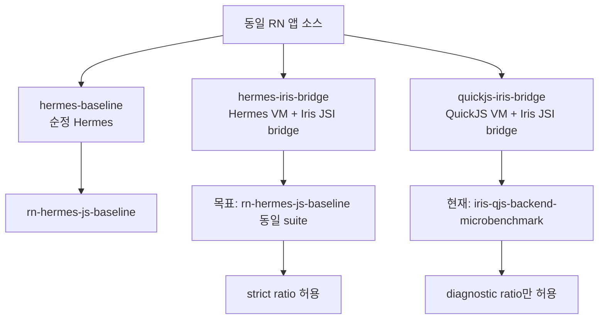

# 벤치마크 하네스

Iris 벤치마크는 먼저 로컬 산출물 계약을 고정하고, 성능 예산 게이트는 나중에 별도 PR에서 승격한다.

## 로컬 명령

```sh
mise run bench-smoke
mise run bench-js
mise run bench-strict-hbc-engine-compare-smoke
mise run bench-strict-hbc-engine-compare
mise run bench-strict-hbc-engine-compare-repeat
mise run bench-strict-hbc-compare-artifacts -- --baseline=artifacts/bench/strict-hbc-engine-comparison-length-vector.json --candidate=artifacts/bench/strict-hbc-engine-comparison.json
mise run bench-strict-hbc-compare-gate -- --baseline=artifacts/bench/strict-hbc-baseline-repeat-summary.json --candidate=artifacts/bench/strict-hbc-candidate-repeat-summary.json
mise run bench-strict-hbc-call-targets
mise run bench-strict-hbc-math-lookup
mise run bench-strict-hbc-profile
mise run bench-strict-hbc-source-shape
mise run bench-qjs-smoke
mise run bench-qjs
mise run bench-android-release
mise run bench-android-release-repeat
mise run bench-android-hermes-iris-bridge-local
mise run bench-android-engine-compare-check
mise run bench-android-engine-compare-local-check
mise run bench-android-engine-compare
mise run bench-android-iris-bootstrap-local
mise run bench-android-iris-qjs-local
mise run bench-android-local-performance
mise run bench-android-local-performance-report
mise run bench-android-runtime-lanes-local
mise run bench-android-runtime-lanes-report
mise run bench-extract-fixture
mise run bench-extract-release-fixture
mise run bench-extract-android-release-fixture
mise run rn-codegen
mise run rn-android-build-debug
mise run rn-android-build-iris-engine
mise run rn-android-build-iris-release
mise run rn-android-build-iris-release-local
mise run rn-android-build-engine-comparison
mise run rn-android-build-engine-comparison-local
mise run rn-ios-build-debug
mise run rn-android-build-release
mise run rn-ios-build-release
```

- `bench-smoke`는 짧은 반복으로 하네스와 JSON schema가 동작하는지 확인한다.
- `bench-js`는 Hermes 기준선 앱과 같은 JS benchmark case를 로컬 JavaScript runtime에서 실행한다.
- `bench-strict-hbc-engine-compare-smoke`는 같은 Hermes bytecode 파일을 Hermes runner와 Iris scalar executor에 짧게 실행해 checksum과 strict HBC 비교 하네스를 확인한다.
- `bench-strict-hbc-engine-compare`는 같은 Hermes bytecode 파일을 Hermes runner와 Iris scalar executor에 실행해 host-side strict HBC ratio artifact를 만든다. 기본값은 `--warmup=5 --iterations=15 --rounds=2`이며 round마다 엔진 실행 순서와 case 순서를 교차해 Hermes-first/Iris-first 및 case order 편향을 줄인다. RN release app, JSI, Fabric, TurboModule 경계 비교값은 아니다. 기본 case set은 `*-lexical.js`와 `*-diagnostic.js` case를 자동 포함하지 않는다.
- `bench-strict-hbc-engine-compare-repeat`는 같은 strict HBC engine comparison을 여러 번 실행하고 run별 artifact와 stability summary를 남긴다. 기본값은 `--runs=4 --discard-initial-runs=1 --max-spread-percent=5`이며, 첫 run은 cold/noisy run으로 artifact에는 남기되 summary 계산에서는 제외한다. discard 후 최소 2개 run이 남아야 한다. checksum이 모두 같고 Iris p50 relative spread가 기준 이하일 때만 해당 case를 `stable`로 표시한다. `--reuse-existing`을 주면 run을 새로 실행하지 않고 `--run-output-dir`의 기존 run artifact만 다시 요약한다. `unstable` case는 빠르다/느리다 결론에 쓰지 않고 재측정하거나 더 좁은 case 단독 artifact로 분리한다.
- `bench-strict-hbc-compare-artifacts`는 이미 생성된 strict HBC engine comparison artifact 또는 repeat summary 두 개를 비교해 case별 Iris p50/p95 절대값 변화와 Hermes 대비 ratio 변화를 JSON과 콘솔 표로 남긴다. repeat summary를 입력하면 각 case의 median 값을 비교한다. 기본 `--noise-threshold-percent=2` 이내의 Iris p50 변화는 `within-threshold`로 판정한다. 이 명령은 엔진을 실행하지 않으므로 A/B 해석 보조 도구이며 새 성능 측정값은 아니다.
- `bench-strict-hbc-compare-gate`는 같은 비교를 수행하되 `--gate`를 켜서 실패 조건을 exit code로 만든다. 기본값은 `--allow-slower-cases=0`, `--noise-threshold-percent=2`이며, checksum mismatch, baseline에 없는 candidate case, baseline/candidate repeat summary의 unstable case, 2%를 넘는 Iris p50 회귀가 있으면 실패한다. repeat summary 안정성 검사를 임시로 완화할 때만 `--allow-unstable-repeat`을 사용한다.
- `bench-strict-hbc-call-targets`는 `js-compute`와 Math 함수 binding diagnostic case를 비교해 global/property lookup 비용과 native Math call 비용을 분리한다.
- `bench-strict-hbc-math-lookup`은 Math 함수를 호출하지 않고 `Math.sin/sqrt` property lookup만 반복하는 diagnostic case와 bound function reference case를 비교한다.
- `bench-strict-hbc-profile`은 같은 strict HBC case를 Hermes bytecode로 컴파일하고 Iris scalar executor의 동적 opcode/property/call hot path profile을 `artifacts/bench/strict-hbc-profile.txt`와 `artifacts/bench/strict-hbc-profile.json`에 남긴다. JSON artifact schema는 `iris.benchmark.strict-hbc-profile.v1`이며 `topInstructionOffsets`, `topPropertyAccesses`, `topIndexedAccesses`, `topCallTargets`를 case별로 구조화한다. 이 값은 성능 ratio가 아니라 다음 최적화 후보 선정용 계측이다. 기본 profile도 `*-lexical.js`와 `*-diagnostic.js` case를 자동 포함하지 않는다.
- `bench-strict-hbc-source-shape`는 전역 `var` 기반 case와 top-level lexical binding case를 같이 실행해 source shape가 HBC opcode mix와 Iris/Hermes ratio에 주는 영향을 분리한다.
- `bench-qjs-smoke`는 짧은 반복으로 host-side Iris QuickJS backend microbenchmark와 checksum을 확인한다.
- `bench-qjs`는 같은 JS benchmark case를 host-side `iris-qjs` backend에서 release 빌드로 실행한다. 이 값은 RN strict engine comparison이 아니라 backend microbenchmark다.
- `bench-android-release`는 Android 물리 기기에서 순정 Hermes release APK 설치, 앱 실행, `Run suite`, 로그 저장, release artifact 추출을 한 번에 수행한다.
- `bench-android-release-repeat`는 같은 release APK에서 3회 반복 측정하고 run별 report와 summary artifact를 남긴다.
- `bench-android-hermes-iris-bridge-local`은 `hermesBridgeRelease` APK를 물리 기기에서 실행하고 `hermes-iris-bridge` lane artifact를 추출한다. 현재 이 lane은 Hermes VM을 유지한 채 Iris-owned JSI HostFunction fast path와 native-owned `ArrayBuffer` handoff를 설치해 TurboModule/JS copy 경계와 비교한다. 멀티스레드 JSI transfer는 아직 구현되지 않았다.
- `bench-android-engine-compare-check`는 현재 HBC 비교 모드 preflight다. Hermes/Iris APK와 bundle을 확인해 두 release variant가 byte-identical Hermes bytecode를 입력으로 쓰는지 검증한다. Iris 전용 bundle pipeline이 들어오면 같은 앱 소스와 artifact manifest parity를 검증하도록 확장해야 한다.
- `bench-android-engine-compare-local-check`는 로컬 skeleton AAR로 Hermes/Iris APK를 빌드하고 같은 preflight만 실행한다. 이 경로는 성능 비교를 만들지 않는다.
- `bench-android-engine-compare`는 Hermes release APK와 Iris release APK를 같은 하네스로 순서대로 측정하고 비교 artifact를 남긴다. Iris APK가 없으면 실패한다.
- `bench-android-iris-bootstrap-local`은 로컬 skeleton Iris release APK를 물리 기기에서 실행하고 `iris-engine-bootstrap` artifact를 logcat에서 추출한다. 현재 case는 HBC metadata parse, static coverage scan, scalar execution이다.
- `bench-android-iris-qjs-local`은 로컬 skeleton Iris release APK를 물리 기기에서 실행하고 `iris-qjs-backend-microbenchmark` artifact를 logcat에서 추출한다. 이 값은 Android 기기 위 QuickJS backend microbenchmark이며 RN strict engine comparison은 아니다.
- `bench-android-local-performance`는 로컬 skeleton 기준으로 Hermes release JS 기준선과 Iris native bootstrap/scalar execution/native mirror 측정을 연속 실행한 뒤 성능 리포트를 남긴다. strict engine ratio는 금지하고, case별 native mirror ratio만 별도 필드에 기록한다.
- `bench-android-local-performance-report`는 이미 생성된 Hermes/Iris summary에서 같은 성능 리포트만 다시 생성한다.
- `bench-android-runtime-lanes-local`은 현재 측정 가능한 Android lane인 Hermes 기준선, Hermes+Iris JSI bridge, QuickJS backend microbenchmark를 갱신하고 세 lane report를 쓴다.
- `bench-android-runtime-lanes-report`는 기존 summary에서 세 lane report만 다시 쓴다.
- `bench-extract-fixture`는 fixture 로그에서 Hermes report를 추출해 파서와 검증 규칙을 확인한다.
- `bench-extract-release-fixture`는 release/Hermes/New Architecture/TurboModule case 요구 조건을 확인한다.
- `bench-extract-android-release-fixture`는 Android logcat의 quoted JSON 형식과 RN 0.85 bridgeless Android의 TurboModule case 기준 검증을 확인한다.
- `rn-codegen`은 TurboModule spec이 RN codegen에서 생성되는지 로컬에서 확인한다.
- `rn-android-build-debug`와 `rn-ios-build-debug`는 네이티브 연결 확인용이며 성능 기준선으로 쓰지 않는다. Android debug는 Hermes flavor를 기준으로 빌드한다.
- `rn-android-build-release`와 `rn-ios-build-release`는 최적화된 RN/Hermes 기준선 수집 전 release 빌드를 확인한다. Android release는 Hermes flavor를 기준으로 빌드한다. iOS task는 simulator build 확인용이며 최종 성능 기준선은 물리 기기에서 남긴다.
- `rn-android-build-iris-engine`은 로컬 Iris Android 엔진 AAR skeleton을 빌드한다.
- `rn-android-build-iris-release`는 `IRIS_ENGINE_AAR`가 실제 RN 호환 Iris 엔진 artifact를 가리킬 때만 `irisRelease` APK를 빌드한다.
- `rn-android-build-iris-release-local`은 로컬 skeleton AAR로 `irisRelease` APK 빌드 계약을 검증한다. 이 APK는 Iris-owned JSI runtime과 RN 초기화용 host surface를 만들지만 bundle 실행에서 의도적으로 실패하므로 성능 비교값으로 쓰지 않는다.
- `rn-android-build-engine-comparison`은 실제 Iris AAR을 사용해 Hermes/Iris release APK를 모두 빌드한다.
- `rn-android-build-engine-comparison-local`은 로컬 skeleton AAR을 사용해 Hermes/Iris release APK를 모두 빌드하고 preflight 재현성을 확인한다.
- 이 명령들은 CI 필수 체크에 포함하지 않는다.

## 산출물

```text
artifacts/bench/js-baseline-smoke.json
artifacts/bench/js-baseline.json
artifacts/bench/qjs-baseline-smoke.json
artifacts/bench/qjs-baseline.json
artifacts/bench/hermes-baseline-fixture.json
artifacts/bench/hermes-release-baseline-fixture.json
artifacts/bench/hermes-android-release-baseline-fixture.json
artifacts/bench/hermes-baseline.json
artifacts/bench/hermes-release-baseline.json
artifacts/bench/hermes-release-baseline-run-*.json
artifacts/bench/hermes-release-baseline-summary.json
artifacts/bench/strict-hbc-engine-comparison-smoke.json
artifacts/bench/strict-hbc-engine-comparison.json
artifacts/bench/strict-hbc-engine-comparison-*.json
artifacts/bench/strict-hbc-engine-comparison-repeat-summary.json
artifacts/bench/strict-hbc-repeat/*.json
artifacts/bench/strict-hbc-artifact-comparison.json
artifacts/bench/strict-hbc-engine-comparison-call-targets.json
artifacts/bench/strict-hbc-engine-comparison-math-lookup.json
artifacts/bench/strict-hbc-profile.txt
artifacts/bench/strict-hbc-profile-*.txt
artifacts/bench/strict-hbc/*.hbc
artifacts/bench/hermes-iris-bridge-baseline-run-*.json
artifacts/bench/hermes-iris-bridge-baseline-summary.json
artifacts/bench/iris-release-baseline-run-*.json
artifacts/bench/iris-release-baseline-summary.json
artifacts/bench/iris-bootstrap-baseline-run-*.json
artifacts/bench/iris-bootstrap-baseline-summary.json
artifacts/bench/iris-qjs-android-baseline-run-*.json
artifacts/bench/iris-qjs-android-baseline-summary.json
artifacts/bench/android-local-performance-report.json
artifacts/bench/android-runtime-lanes-report.json
artifacts/bench/android-engine-comparison.json
artifacts/bench/rn-release-hermes-run-*.log
artifacts/bench/rn-release-iris-run-*.log
artifacts/bench/rn-release-iris-bootstrap-run-*.log
```

산출물 schema는 `iris.benchmark.v1`이며 다음 정보를 포함한다.

- app, platform, build, React Native, runtime metadata
- benchmark case id, 설명, warmup 횟수, measured 횟수
- sample, min, max, mean, p50, p95
- checksum과 detail

## 앱 내 실행

`apps/rn-bench`에서 `Run suite` 버튼을 누르면 같은 benchmark case를 Hermes 런타임에서 실행하고 JSON report를 logcat에 출력한다. payload가 짧으면 `IRIS_BENCHMARK_ARTIFACT` 한 줄로 남기고, Android logcat 한 줄 제한을 넘을 수 있는 report는 `IRIS_BENCHMARK_ARTIFACT_CHUNK` chunk를 이어 붙여 추출한다.

## 엔진 비교 원칙

Iris가 Hermes를 대체하는 엔진으로 들어가는 비교는 독립 앱 두 개가 아니라 같은 `apps/rn-bench` 소스의 엔진별 release variant 두 개로 수행한다. 제품 목표는 Hermes HBC 형식 호환이 아니라 React Native/Hermes 관측 가능 동작 호환과 기존 앱 코드 마이그레이션 0이다. 기준은 다음과 같다.

- `Hermes release`와 `Iris release`는 같은 benchmark JS, 같은 RN 버전, 같은 native module surface를 사용한다.
- strict RN 엔진 비교 case 계약은 `tools/bench/strict-rn-benchmark-contract.ts`에 고정한다. 두 엔진 summary는 이 case set을 정확히 포함해야 하며 case별 checksum이 같아야 한다.
- Iris 전용 bundle pipeline을 사용해도 앱 소스는 Hermes 기준선과 같아야 하며 compiler, source hash, transform option, runtime backend를 artifact에 기록해야 한다.
- HBC 비교 모드에서는 두 release variant의 generated `index.android.bundle`과 APK 내부 `assets/index.android.bundle`이 Hermes bytecode magic, bytecode version, source hash, file length, SHA-256까지 같아야 한다.
- Hermes APK에는 `libhermesvm.so`가 있어야 하고 `libirisengine.so`/`libjsc.so`가 없어야 한다.
- Iris APK에는 `libirisengine.so`가 있어야 하고 `libhermesvm.so`/`libjsc.so`가 없어야 한다. `libhermestooling.so`는 RN의 hermesc packaging 경로 때문에 허용한다.
- 앱 프로젝트를 복제하지 않는다. 복제 앱은 Gradle, RN, ProGuard, Codegen, assets 설정이 drift되어 비교 신뢰도를 떨어뜨린다.
- Iris 엔진 artifact가 준비되기 전에는 JSC나 Hermes를 `Iris release` 대체값으로 쓰지 않는다.
- QuickJS backend는 Iris-owned runtime 내부 구현으로 사용할 수 있다. 단 RN 앱 코드 수정을 요구하지 않고 Hermes 관측 가능 동작 shim과 검증 계획을 제공해야 한다.
- `bench-qjs`는 QuickJS backend가 같은 JS case의 checksum을 맞추는지 확인하는 host-side microbenchmark다. OS, device, JSI, Fabric, TurboModule 경계가 RN/Hermes release와 다르므로 이 값으로 "엔진만 바꿨더니 빨라짐"을 주장하지 않는다.
- V8은 iOS 동일 비교축이 없으므로 기본 Hermes 대체 엔진 후보나 벤치마크 비교 대상으로 두지 않는다.
- Hermes/JSC fallback을 Iris 성능값으로 측정하지 않는다.
- 현재 `iris-module-native-compute`는 엔진 대체 성능값이 아니라 Hermes 앱 안에서 Iris native module 경로를 확인하는 probe다.

## 세 비교군

Iris 성능 목표는 다음 세 lane으로 관리한다. 모든 lane은 같은 RN 앱 소스와 같은 release/물리 기기 조건을 목표로 하며, strict ratio는 같은 suite와 같은 case set을 실제 JS 실행으로 완료했을 때만 허용한다.



| lane                  | 의미                                                                                       | 현재 상태 | ratio 정책                                                                                                                          |
| --------------------- | ------------------------------------------------------------------------------------------ | --------- | ----------------------------------------------------------------------------------------------------------------------------------- |
| `hermes-baseline`     | RN 0.85, New Architecture, 순정 Hermes release 기준선                                      | 측정 가능 | 기준선                                                                                                                              |
| `hermes-iris-bridge`  | Hermes VM은 유지하고 Iris가 JSI fast path, native-owned buffer, 멀티스레드 JSI 경계를 담당 | 부분 구현 | Hermes 기준선 ratio는 참고용이다. 같은 앱 내부 TurboModule/JS copy 대비 JSI fast path ratio는 bridge boundary microbenchmark로 허용 |
| `quickjs-iris-bridge` | QuickJS backend 위에 같은 Iris JSI 경계 정책을 적용하는 Iris runtime                       | 부분 측정 | 현재 QuickJS backend microbenchmark만 가능하므로 Hermes 대비 ratio는 참고용                                                         |

세 lane 정의는 `tools/bench/runtime-lanes.ts`에 둔다. 기존 summary에서 현재 상태를 다시 쓰려면 다음 명령을 사용한다.

```sh
mise run bench-android-runtime-lanes-report
```

물리 기기에서 현재 측정 가능한 lane을 갱신하려면 다음 명령을 사용한다.

```sh
mise run bench-android-runtime-lanes-local
```

이 명령은 `android-runtime-lanes-report.json`에 lane별 `measurementStatus`, `runtimeBackend`, `strictComparableWithBaseline`, `requiredCapabilities`를 기록한다. `hermes-iris-bridge`는 같은 Hermes VM에서 Iris-owned JSI HostFunction fast path와 native-owned `ArrayBuffer` handoff를 설치하지만, Hermes 기준선과의 공통 case ratio는 아직 strict engine ratio가 아니다. bridge 효과는 같은 앱 내부에서 TurboModule/JS copy case와 `iris-jsi-*` case를 비교한 `bridgeComparisons`로만 해석한다.

현재 Android 물리 기기 3회 요약에서 `hermes-iris-bridge`의 bridge boundary 결과는 다음이다.

| 비교 구간                  | reference p50 mean | Iris JSI p50 mean | JSI/reference p50 | 포맷 동일성                                  |
| -------------------------- | ------------------ | ----------------- | ----------------- | -------------------------------------------- |
| direct number round trip   | `2.585ms`          | `0.383ms`         | `0.1482x`         | 동일 number 입출력                           |
| direct string round trip   | `3.377ms`          | `0.933ms`         | `0.2763x`         | 동일 string 입출력                           |
| direct native compute      | `80.319ms`         | `75.347ms`        | `0.9381x`         | 동일 number 입출력                           |
| same method facade number  | `2.585ms`          | `0.538ms`         | `0.2081x`         | 동일 method/payload surface                  |
| same method facade string  | `3.377ms`          | `1.006ms`         | `0.2979x`         | 동일 method/payload surface                  |
| same method facade compute | `80.319ms`         | `75.353ms`        | `0.9382x`         | 동일 method/payload surface                  |
| columnar object traversal  | `26.429ms`         | `3.672ms`         | `0.1389x`         | JS object에서 columnar로 변경                |
| native buffer handoff      | `612.664ms`        | `9.738ms`         | `0.0159x`         | JS-owned copy에서 native-owned buffer로 변경 |

이 결과는 "엔진을 바꿔서 JS 자체가 빨라졌다"가 아니라 "Hermes VM 안에서도 RN TurboModule 경계 일부는 Iris-owned JSI HostFunction fast path로 줄일 수 있다"는 근거다. number/string은 데이터 포맷이 같고, `same method facade`는 JS wrapper가 TurboModule과 같은 method/payload surface를 유지한 상태에서도 경계 비용이 줄어드는지 확인하는 case다. native compute는 실제 계산 시간이 대부분이라 경계 단축 효과가 작다. columnar object traversal과 native buffer handoff는 포맷 변경이 들어간 zero-copy 방향 후보의 diagnostic ratio다. checksum은 같지만 JS object array나 JS-owned `Uint8Array` copy와 같은 통신 포맷이라고 해석하지 않는다.

Android는 `engine` flavor를 사용한다. 두 flavor는 같은 앱 소스에서 빌드되지만 설치 ID와 런처 이름이 달라 같은 물리 기기에 동시에 설치할 수 있다.

- `hermesRelease`: 기본 기준선이며 앱 ID는 `com.iris.bench.hermes`, 런처 이름은 `IrisBench Hermes`다.
- `hermesBridgeRelease`: Hermes VM을 유지한 Iris bridge lane이며 앱 ID는 `com.iris.bench.hermesbridge`, 런처 이름은 `IrisBench Hermes Bridge`다. 현재 `libirisbridge.so`를 포함하고 `IrisBridgeTurboModule`이 `global.__irisBridgeFastPath` HostFunction surface, same-method JS facade, native-owned `ArrayBuffer` handoff를 설치한다.
- `irisRelease`: 앱 ID는 `com.iris.bench.iris`, 런처 이름은 `IrisBench Iris`다. `IRIS_ENGINE_AAR`가 실제 RN 호환 Iris 엔진 artifact를 가리킬 때만 빌드한다.

Iris release APK는 다음처럼 빌드한다.

```sh
IRIS_ENGINE_AAR=/absolute/path/to/iris-engine.aar mise run rn-android-build-iris-release
```

Iris AAR은 `docs/iris-android-engine-contract.md`의 `IrisJSRuntimeFactoryProvider.create(): JSRuntimeFactory` 계약을 제공해야 한다. 이 계약이 없으면 `irisRelease`는 컴파일 단계에서 실패한다.

로컬 skeleton AAR로 계약만 확인할 때는 다음 명령을 사용한다.

```sh
mise run rn-android-build-iris-release-local
```

이 APK는 `libirisengine.so`와 현재 skeleton의 HBC bootstrap artifact가 같이 패키징되고 RN이 Iris-owned JSI runtime 객체와 초기화용 host surface를 받는지 확인하기 위한 것이다. 아직 Iris runtime의 JS 실행 기능이 구현되지 않았으므로 Hermes와의 RN JS workload 비교값으로 쓰지 않는다. RN 0.85 기준 local skeleton HBC gap의 현재 coverage는 `supportedInstructions=2903/2903`, `supportedUniqueOpcodes=46/46`, `unsupportedUniqueOpcodes=0`, `firstUnsupported=none`이다. 현재 Rust scalar executor는 같은 bundle에서 bounded scalar execution을 시도하고, 완료하면 `status=completed`, 의미론 차단점이나 `SCALAR_EXECUTION_GLOBAL_STEP_LIMIT=500000`에 도달하면 `status=frontier`를 detail에 남긴다. 이는 RN 화면 렌더 완료, Fabric/TurboModule 실행 완료, Hermes/RN 실행 호환성 완료, 성능 우위를 의미하지 않는다.

로컬에서 APK 실행 없이 같은 report를 확인할 때는 다음 명령을 사용한다.

```sh
mise run bench-android-iris-hbc-gap-local
mise run bench-android-iris-hbc-exec-local
mise run bench-android-iris-hbc-trace-local
```

Iris native bootstrap 비용은 물리 기기에서 다음 명령으로 측정한다.

```sh
mise run bench-android-iris-bootstrap-local
```

이 명령은 `irisRelease` APK를 설치하고 앱 시작 중 `IRIS_BENCHMARK_ARTIFACT_CHUNK` logcat payload를 모아 `iris-engine-bootstrap` report를 만든다. 현재 bootstrap case는 `iris-hbc-metadata-parse`, `iris-hbc-static-coverage-scan`, `iris-hbc-scalar-execution-frontier`, `iris-hbc-strict-scalar-execution`이다. 기존 artifact 호환 때문에 relaxed case id에는 `frontier`가 남아 있지만, relaxed/strict 두 execution case 모두 detail에 `status=completed` 또는 `status=frontier`를 기록한다. 현재 RN 0.85 local skeleton bundle에서는 Metro `__r` 순환 module cache를 반영한 scalar execution이 `detail=status=completed, value=Object(...), declaredGlobals=4`까지 도달한다. RN JS bundle의 React 앱 렌더, Fabric/TurboModule 경계, JSI object/function runtime을 끝까지 실행하는 단계는 아니므로 Hermes release의 `rn-hermes-js-baseline`과 strict ratio를 계산하지 않는다.

2026-06-18 물리 Android 기기 `ITAB X40L Plus` 기준 최신 local skeleton bootstrap 3회 평균 p50은 HBC metadata parse `277.249ms`, static coverage scan `279.709ms`, relaxed scalar execution `408.652ms`, strict scalar execution `407.946ms`다. strict scalar p95 평균은 `408.678ms`다. 이 값은 Android 기기 위 Iris-owned HBC scalar bootstrap 실행 비용이며 RN strict engine comparison 값이 아니다.

2026-06-18 host-side RN 0.85 local skeleton HBC bundle strict trace는 `status=completed, value=Object(...), declaredGlobals=4`까지 도달한다. 같은 bundle을 `hbc-bench --warmup=5 --iterations=10`로 실행한 scalar bootstrap sample은 `14.566584ms`, `14.092542ms`, `13.961750ms`, `14.506375ms`, `13.932250ms`, `14.171541ms`, `13.650000ms`, `13.868791ms`, `14.048416ms`, `14.203209ms`다. 이는 Rust scalar executor host-side 측정이며 Hermes release RN workload ratio가 아니다.

2026-06-18 host-side `bench-strict-hbc-engine-compare --warmup=5 --iterations=15 --rounds=2`의 checksum은 모든 case에서 일치했다. p50 Iris/Hermes ratio는 `branch-loop=3.2799x`, `js-compute=3.7046x`, `json-round-trip=2.0699x`, `numeric-loop=3.8094x`, `object-traversal=5.5161x`, `property-loop=5.0479x`, `typed-array-copy=2.6577x`였다. p95 Iris/Hermes ratio는 `branch-loop=3.2692x`, `js-compute=3.5202x`, `json-round-trip=2.1474x`, `numeric-loop=3.7988x`, `object-traversal=5.5835x`, `property-loop=5.0545x`, `typed-array-copy=2.6765x`였다. Iris p50 절대값은 `branch-loop=24.992ms`, `js-compute=155.433ms`, `json-round-trip=34.713ms`, `numeric-loop=39.647ms`, `object-traversal=18.608ms`, `property-loop=23.885ms`, `typed-array-copy=160.627ms`였다. 이 ratio는 1보다 크면 현재 Iris scalar executor가 Hermes보다 느리다는 뜻이며, host-side thermal/load 영향이 남아 있으므로 개선 판단은 case 단독 artifact와 Iris p50 절대값을 같이 본다.

2026-06-18 `bench-strict-hbc-engine-compare-repeat`의 기존 3개 run artifact를 `--discard-initial-runs=1 --reuse-existing`으로 재요약했을 때 모든 case checksum은 안정적이었고 Iris p50 spread는 기준값 `5%` 이하로 들어왔다. 첫 run 제외 후 median Iris p50과 p50 Iris/Hermes ratio는 `branch-loop=32.755ms/4.161x`, `js-compute=233.493ms/5.454x`, `json-round-trip=42.535ms/2.443x`, `numeric-loop=56.976ms/5.255x`, `object-traversal=20.365ms/5.468x`, `property-loop=32.223ms/6.754x`, `typed-array-copy=165.667ms/2.643x`였다. 이 repeat summary는 단발 artifact보다 보수적인 안정성 확인값이며, host load가 높은 상태의 절대 시간까지 포함하므로 최적화 채택 여부는 같은 방식으로 만든 baseline/candidate repeat summary끼리 비교한다.

2026-06-18 hotpath subset `--case=branch-loop --case=numeric-loop --case=property-loop --case=typed-array-copy` repeat 기준선은 첫 run 제외 후 `branch-loop=26.600ms/3.382x`, `numeric-loop=40.661ms/3.677x`, `property-loop=24.800ms/5.099x`, `typed-array-copy=168.637ms/2.729x`였다. 이 중 `typed-array-copy`는 Iris p50 spread `7.571%`로 unstable이었다. global property read/write의 iterator chain을 수동 `for` loop helper로 바꾼 candidate는 checksum은 유지했지만 `branch-loop`가 unstable이면서 Iris p50 `+8.642%` 회귀했고 gate가 실패했다. 따라서 이 수동 global loop 변경은 제거했고 채택하지 않는다.

2026-06-18 `bench-strict-hbc-profile --case=branch-loop --case=numeric-loop --case=property-loop --case=typed-array-copy`는 텍스트 artifact와 같은 내용을 `artifacts/bench/strict-hbc-profile-current-hotpaths.json`에도 남긴다. 이 구조화 artifact 기준 hot instruction offset은 `branch-loop`의 `Add(30)@405`, `Mod(37)@342`, `GetByIdShort(68)@337/@400/@415`, `numeric-loop`의 `Add(30)@303/@331`, `MulN(34)@299`, `Mod(37)@295/@312`, `typed-array-copy`의 `Add(30)@433`, `Mod(37)@420`, `GetByIdShort(68)@405/@410/@415`처럼 loop body에 집중된다. Trace상 `numeric-loop`의 hot get/put은 `r6` global base와 `checksum`/`index` property 반복이다. 그러나 broad global fast path, global cache, named get/put direct expansion 계열은 이미 여러 A/B에서 회귀했으므로, 다음 후보는 같은 broad global cache 재시도가 아니라 opcode/operand dispatch를 줄이는 더 좁은 형태로 분리해 측정한다.

2026-06-18 `GetByIdShort(68)`/`PutByIdLoose(74)`에서 base register가 실제 `globalThis`일 때만 generic named property helper를 우회하는 제한적 global-base fast path를 채택했다. Hotpath subset repeat artifact `artifacts/bench/strict-hbc-global-base-fastpath-candidate-repeat-summary.json`은 기준선 대비 `branch-loop` `26.600 -> 24.227ms`(-8.921%), `numeric-loop` `40.661 -> 36.579ms`(-10.039%), `property-loop` `24.800 -> 22.252ms`(-10.275%), `typed-array-copy` `168.637 -> 148.889ms`(-11.710%)였다. Full default case repeat artifact `artifacts/bench/strict-hbc-global-base-fastpath-candidate-full-repeat-summary.json`은 `numeric-loop`(-36.042%), `js-compute`(-34.451%), `branch-loop`(-29.991%), `property-loop`(-26.675%), `typed-array-copy`(-13.458%), `json-round-trip`(-7.073%)를 개선했다. Full gate는 `object-traversal` 한 케이스가 noisy run 때문에 실패했지만, object-traversal 단독 5-run artifact `artifacts/bench/strict-hbc-global-base-fastpath-object-only-repeat-summary.json`은 `20.365 -> 18.963ms`(-6.887%)였다. 따라서 이 후보는 채택하되, object-traversal/property-loop처럼 spread가 큰 case는 다음 후보 평가 때 단독 repeat로 재확인한다.

2026-06-18 jump target을 instruction별로 미리 계산하는 candidate는 코드 의미론과 checksum을 유지했지만, global-base fast path 기준 hotpath subset에서 `branch-loop` `24.227 -> 24.646ms`, `numeric-loop` `36.579 -> 36.988ms`, `property-loop` `22.252 -> 22.292ms`, `typed-array-copy` `148.889 -> 150.315ms`로 모두 2% threshold 안의 미세 악화였다. Gate는 통과했지만 개선이 없으므로 predecode 코드는 제거했고 채택하지 않는다. Artifact는 `artifacts/bench/strict-hbc-jump-target-predecode-candidate-repeat-summary.json`와 `artifacts/bench/strict-hbc-artifact-comparison-jump-target-predecode-candidate.json`에 남겼다.

2026-06-18 `TryGetById(72)`에서 base register가 실제 `globalThis`이고 property가 `Math`일 때만 generic named property helper를 우회하는 제한적 fast path를 채택했다. 더 넓은 global `TryGetById` fast path는 `js-compute`를 개선했지만 hotpath repeat에서 `property-loop` outlier와 `numeric-loop` 소폭 회귀가 섞여 gate가 깨끗하지 않았기 때문에 폐기하고, profile상 120만 회 반복되는 `globalThis.Math` lookup만 대상으로 좁혔다. 최종 `js-compute` 단독 5-run artifact `artifacts/bench/strict-hbc-try-get-global-math-js-only-repeat-summary.json`은 global-base 기준 `153.052 -> 147.439ms`(-3.667%)였고 gate artifact `artifacts/bench/strict-hbc-artifact-comparison-try-get-global-math-js-only.json`는 통과했다. Hotpath subset artifact `artifacts/bench/strict-hbc-try-get-global-math-hotpath-only-repeat-summary.json`은 모두 stable이었고, `branch-loop` `24.227 -> 23.076ms`(-4.748%), `typed-array-copy` `148.889 -> 144.643ms`(-2.852%), `property-loop` `22.252 -> 22.071ms`(-0.816%), `numeric-loop` `36.579 -> 36.915ms`(+0.919%, threshold 내)로 gate artifact `artifacts/bench/strict-hbc-artifact-comparison-try-get-global-math-hotpath-only.json`가 통과했다.

2026-06-18 `Math.sin`/`Math.sqrt` intrinsic property read를 case `68`에서 직접 처리하는 candidate는 기존 helper의 own-property shadowing 순서를 보존했고 `js-compute` 단독 artifact `artifacts/bench/strict-hbc-math-intrinsic-property-fastpath-js-only-repeat-summary.json`에서 `147.439 -> 140.853ms`(-4.467%)를 보였다. 하지만 hotpath subset artifact `artifacts/bench/strict-hbc-math-intrinsic-property-fastpath-hotpath-only-repeat-summary.json`는 `branch-loop`가 unstable이고 기준 대비 `branch-loop` `+10.542%`, `numeric-loop` `+2.383%` 회귀로 gate artifact `artifacts/bench/strict-hbc-artifact-comparison-math-intrinsic-property-fastpath-hotpath-only.json`가 실패했다. 따라서 이 코드는 제거했고 채택하지 않는다. `Math` object property lookup은 다음에 opcode layout 영향이 덜한 별도 helper/IC 형태로 다시 봐야 한다.

2026-06-18 `read_scalar_intrinsic_object_property`에서 `Math` 분기를 앞쪽으로 옮기는 candidate는 `js-compute` 단독 artifact `artifacts/bench/strict-hbc-math-intrinsic-branch-order-js-only-repeat-summary.json`에서 `147.439 -> 146.536ms`(-0.613%)였고 gate artifact `artifacts/bench/strict-hbc-artifact-comparison-math-intrinsic-branch-order-js-only.json`는 통과했다. 하지만 개선 폭이 2% noise threshold 안이라 채택하지 않고 코드를 원래 순서로 되돌렸다.

2026-06-18 `bench-strict-hbc-profile` 동적 profile에서는 모든 case의 최다 opcode가 `GetByIdShort(68)`였다. 실행 횟수는 `typed-array-copy=7,000,712`, `js-compute=4,200,004`, `numeric-loop=1,000,002`, `property-loop=960,004`, `branch-loop=600,004`, `object-traversal=331,205`, `json-round-trip=272,009`다. profile artifact는 `topPropertyAccesses`, `topIndexedAccesses`, `topCallTargets`, `topCallArgumentKinds`도 기록해 같은 operand, call target, call argument kind를 분리한다. 주요 named hot path는 `typed-array-copy`의 `get:global:index=4,000,001`, `get:global:source=2,000,003`, `get:uint8-array:length=1,000,103`, `js-compute`의 `get:global:index=2,400,001`, `get:global:Math=1,200,001`, `get:math:sin=600,000`, `get:math:sqrt=600,000`, `property-loop`의 `get:global:row=400,002`, `get:global:index=240,001`, `get:plain-object:score=160,000`이다. 주요 indexed hot path는 `typed-array-copy`의 `put-index:uint8-array:numeric=1,000,000`, `json-round-trip`의 `put-index:array:numeric=32,000`, `get-index:array:numeric=8,000`, `object-traversal`의 `get-index:array:numeric=12,000`, `put-index:array:numeric=12,000`이다. 주요 call target은 `js-compute`의 `call2:NativeMathSin=600,000`, `call2:NativeMathSqrt=600,000`이며, `typed-array-copy`는 `construct:NativeUint8ArrayConstructor=2`, `call2:NativeUint8ArraySet=1`뿐이다. 따라서 다음 최적화 후보는 일반적인 object/global property read path와 opcode dispatch이며, global 변수 접근만 좁게 캐싱해도 개선된다고 가정하면 안 된다. `js-compute`는 별도로 `Math.sin`/`Math.sqrt` host call 비용을 분리해 봐야 한다.

2026-06-18 `bench-strict-hbc-source-shape` diagnostic은 같은 로직을 전역 `var`와 top-level lexical binding으로 각각 컴파일해 비교했다. Iris p50은 `numeric-loop` `40.842ms`에서 `numeric-loop-lexical` `26.364ms`, `js-compute` `168.170ms`에서 `js-compute-lexical` `116.318ms`, `property-loop` `27.805ms`에서 `property-loop-lexical` `12.618ms`, `typed-array-copy` `200.128ms`에서 `typed-array-copy-lexical` `98.782ms`로 줄었다. p50 Iris/Hermes ratio는 각각 `3.8914x -> 3.7743x`, `3.9722x -> 3.8738x`, `5.2336x -> 4.8064x`, `3.3067x -> 2.2617x`였다. lexical profile에서는 `GetByIdShort(68)` 실행 횟수가 `numeric-loop` `1,000,002 -> 0`, `js-compute` `4,200,004 -> 1,200,001`, `property-loop` `960,004 -> 240,000`, `typed-array-copy` `7,000,712 -> 1,000,104`로 감소했다. `topPropertyAccesses` 기준으로는 `numeric-loop-lexical`에서 loop 내부 global get/put이 사라지고 checksum export용 `globalThis`/`__irisStrictHbcChecksum`만 남는다. `typed-array-copy-lexical`도 기존 `get:global:index=4,000,001`, `get:global:source=2,000,003`, `put:global:index=1,000,001`이 사라지고 `get:uint8-array:length=1,000,103`만 주요 named access로 남는다. 이 결과는 `GetByIdShort` 자체보다 top-level `var`가 만드는 global property read/write bytecode shape가 Iris scalar executor에 큰 비용이라는 점을 보여준다. 다만 lexical case는 사용자가 기존 RN 코드를 그대로 실행하는 strict migration workload가 아니라 compiler/source-shape diagnostic이다.

2026-06-18 `bench-strict-hbc-global-access` diagnostic은 같은 checksum 계산을 전역 `var` read/write와 top-level lexical binding으로만 분리했다. Repeat artifact `artifacts/bench/strict-hbc-global-access-diagnostic-repeat-summary.json`은 stable이었고 Iris p50은 `global-access-diagnostic=63.458ms`, `global-access-lexical-diagnostic=26.702ms`였다. p50 Iris/Hermes ratio는 각각 `3.944x`, `3.697x`였다. Profile artifact `artifacts/bench/strict-hbc-profile-global-access-diagnostic.json` 기준 global case는 total instructions `6,000,015`, `GetByIdShort(68)=2,400,002`, `PutByIdLoose(74)=1,200,003`이고 주요 property access는 `get:global:index=1,800,001`, `get:global:checksum=600,001`, `put:global:checksum=600,001`, `put:global:index=600,001`이다. lexical case는 total instructions `3,000,009`이고 loop 내부 global access가 사라져 checksum export용 `globalThis`/`__irisStrictHbcChecksum`만 남는다. 따라서 현재 global `var` 형태는 Iris에서 단순 lexical local loop 대비 instruction count를 약 2배로 늘리고, absolute p50은 약 2.4배로 늘린다. 다음 개선 후보는 global property helper 자체보다 Hermes observable behavior를 유지하는 declared-global slot/IC 계층이지만, 이전 declared global slot table과 2-entry global cache 실험은 회귀했으므로 기존 object/global storage 구조와 충돌하지 않는 더 좁은 설계가 필요하다.

2026-06-18 전역 프로퍼티 read/write의 `string_id -> global_properties index` direct-mapped operand cache를 채택했다. 이 cache는 기존 HBC string operand cache와 같은 slot 계산을 쓰고, cache hit에서도 저장된 property name을 다시 검증한 뒤에만 값을 반환한다. Diagnostic repeat artifact `artifacts/bench/strict-hbc-global-property-operand-cache-candidate-repeat-summary.json`은 `global-access-diagnostic` Iris p50을 `63.458 -> 59.420ms`(-6.365%)로 줄였고, p50 Iris/Hermes ratio는 `3.944x -> 3.645x`였다. `global-access-lexical-diagnostic`은 `26.702 -> 26.500ms`(-0.759%)로 threshold 안이었다. Hotpath 5-run artifact `artifacts/bench/strict-hbc-global-property-operand-cache-hotpath-5run-candidate-repeat-summary.json`는 `typed-array-copy` `144.643 -> 139.957ms`(-3.239%), `numeric-loop` `36.915 -> 36.533ms`(-1.035%, threshold 내), `branch-loop` `23.076 -> 23.022ms`(-0.235%, threshold 내)를 보였다. 같은 subset의 `property-loop`은 한 run outlier로 unstable이었지만 단독 5-run artifact `artifacts/bench/strict-hbc-global-property-operand-cache-property-only-candidate-repeat-summary.json`가 stable이었고 `22.071 -> 20.591ms`(-6.704%)로 gate를 통과했다. 따라서 이 변경은 Iris 내부 global/property-heavy 구간의 p50을 줄이지만, ratio가 여전히 `1.0x`보다 크므로 Hermes보다 빠른 상태는 아니다.

2026-06-18 object property read/write에도 `object handle + string_id -> object_properties index` direct-mapped operand cache를 채택했다. Cache hit은 object handle, string id, property name을 모두 검증한 뒤에만 값을 반환하며, getter/prototype이 있는 객체는 기존 getter/prototype lookup 경로로 fallback한다. 단독 property artifact `artifacts/bench/strict-hbc-object-property-operand-cache-property-only-candidate-repeat-summary.json`은 global property operand cache 기준 `property-loop` Iris p50을 `20.591 -> 18.673ms`(-9.315%)로 줄였고 gate artifact `artifacts/bench/strict-hbc-artifact-comparison-object-property-operand-cache-property-only.json`가 통과했다. Hotpath artifact `artifacts/bench/strict-hbc-object-property-operand-cache-hotpath-candidate-repeat-summary.json`는 `property-loop` `20.576 -> 18.640ms`(-9.406%), `numeric-loop` `36.533 -> 36.241ms`(-0.801%, threshold 내), `typed-array-copy` `139.957 -> 139.040ms`(-0.655%, threshold 내), `branch-loop` `23.022 -> 23.203ms`(+0.787%, threshold 내)였고 `--allow-unstable-repeat` gate를 통과했다. `branch-loop`은 subset run outlier 때문에 unstable이었지만 단독 5-run artifact `artifacts/bench/strict-hbc-object-property-operand-cache-branch-only-candidate-repeat-summary.json`가 stable이었고 `23.022 -> 22.620ms`(-1.748%, threshold 내)로 gate를 통과했다. `js-compute`는 `147.439 -> 145.007ms`(-1.649%)로 threshold 안이므로, 이번 변경의 주효과는 plain-object property-heavy path 개선으로 해석한다.

2026-06-18 `Math.round/sin/sqrt` 전용 intrinsic property operand cache candidate는 `js-compute` 단독 artifact `artifacts/bench/strict-hbc-math-intrinsic-operand-cache-js-only-candidate-repeat-summary.json`에서 Iris p50 `145.007 -> 143.096ms`(-1.318%)였다. 비교 artifact `artifacts/bench/strict-hbc-artifact-comparison-math-intrinsic-operand-cache-js-only.json` 기준 2% noise threshold 안의 `within-threshold`라 채택하지 않고 코드를 제거했다. `Math` property lookup은 다음 후보에서 단순 cache보다 opcode dispatch 또는 call path와 함께 봐야 한다.

2026-06-18 최신 main 전체 strict HBC repeat artifact `artifacts/bench/strict-hbc-latest-main-repeat-summary.json`은 모든 case가 stable이었다. Median Iris p50과 p50 Iris/Hermes ratio는 `branch-loop=22.621ms/2.894x`, `js-compute=145.848ms/3.397x`, `json-round-trip=36.824ms/2.164x`, `numeric-loop=35.536ms/3.109x`, `object-traversal=17.710ms/5.118x`, `property-loop=18.661ms/3.916x`, `typed-array-copy=138.346ms/2.266x`다. 오래된 repeat baseline `artifacts/bench/strict-hbc-engine-comparison-repeat-summary.json` 대비 Iris p50은 `property-loop` -42.089%, `numeric-loop` -37.630%, `js-compute` -37.536%, `branch-loop` -30.940%, `typed-array-copy` -16.491%, `json-round-trip` -13.428%, `object-traversal` -13.039% 개선됐다. Global-base full artifact 대비로도 `object-traversal` -27.965%, `property-loop` -21.021%, `json-round-trip` -6.838%, `js-compute` -4.707%, `typed-array-copy` -3.505%, `numeric-loop` -2.484%였다. 다만 최신 ratio가 모두 `1.0x`보다 크므로, 현 상태는 “Iris가 이전보다 빨라짐”이지 “Hermes보다 빠름”이 아니다.

2026-06-18 global write cache hit에서 `global_properties` 선형 탐색을 건너뛰고 cached index를 직접 갱신하는 후보는 채택하지 않았다. 직접 갱신 후보 artifact `artifacts/bench/strict-hbc-global-write-cache-hit-object-json-repeat-summary.json`은 최신 main 대비 `json-round-trip` Iris p50 `36.824 -> 35.611ms`(-3.294%)였지만 `object-traversal`이 `17.710 -> 18.135ms`(+2.399%)로 회귀했다. `global_properties.len() >= 9`에서만 직접 갱신하는 조건부 후보 `artifacts/bench/strict-hbc-conditional-global-write-cache-hit-object-json-repeat-summary.json`도 `json-round-trip` `36.824 -> 35.838ms`(-2.678%)와 함께 `object-traversal` `17.710 -> 18.721ms`(+5.712%) 회귀를 보였다. 두 후보 모두 checksum은 유지했지만, 반복 global write cache hit은 작은 object traversal workload에서 linear scan보다 분기/검증 비용이 커져 제외한다.

2026-06-18 object property write에서 객체별 property name 목록에 같은 이름이 있을 때만 `(object, property_name)` index lookup을 수행하는 후보를 채택했다. 새 객체에 새 property를 추가하는 `object-traversal`/`json-round-trip` 형태에서는 불필요한 tuple-key HashMap lookup을 피하고, 기존 property 갱신은 name list 확인 뒤 기존 index lookup으로 semantics를 유지한다. Full repeat artifact `artifacts/bench/strict-hbc-object-write-name-check-full-repeat-summary.json`은 최신 main 대비 `json-round-trip` `36.824 -> 34.019ms`(-7.616%), `js-compute` `145.848 -> 141.157ms`(-3.216%), `typed-array-copy` `138.346 -> 136.702ms`(-1.188%, threshold 내), `property-loop` `18.661 -> 18.474ms`(-1.001%, threshold 내), `object-traversal` `17.710 -> 17.550ms`(-0.901%, threshold 내), `branch-loop` `22.621 -> 22.795ms`(+0.771%, threshold 내), `numeric-loop` `35.536 -> 36.081ms`(+1.535%, threshold 내)였고 `--allow-unstable-repeat` gate가 통과했다. Full run에서 unstable이었던 `numeric-loop`은 단독 6-run artifact `artifacts/bench/strict-hbc-object-write-name-check-numeric-only-repeat-summary.json`에서 stable이고 `35.536 -> 35.675ms`(+0.392%, threshold 내)였으며, `object-traversal`은 단독 6-run artifact `artifacts/bench/strict-hbc-object-write-name-check-object-only-repeat-summary.json`에서 stable이고 `17.710 -> 17.328ms`(-2.159%)로 gate를 통과했다.

2026-06-18 equality jump에서 두 피연산자가 모두 `Number`이면 `scalar_strict_equal`/`scalar_abstract_equal` helper를 거치지 않고 opcode 분기 안에서 직접 비교하는 fast path를 채택했다. `NaN === NaN`과 `NaN !== NaN` semantics를 보존하는 단위 테스트를 추가했다. Fresh current-main hotpath artifact `artifacts/bench/strict-hbc-current-main-hotpath-repeat-summary.json` 대비 candidate artifact `artifacts/bench/strict-hbc-number-equality-jump-hotpath-repeat-summary.json`은 `branch-loop` `23.104 -> 22.827ms`(-1.198%), `numeric-loop` `36.716 -> 36.125ms`(-1.610%), `property-loop` `18.859 -> 18.548ms`(-1.651%), `typed-array-copy` `138.468 -> 136.726ms`(-1.258%)였고 모두 stable이었다. 비교 gate는 통과했지만 모든 Iris p50 변화가 2% noise threshold 안이므로 이 변경은 좁은 hotpath 비용 절감으로만 해석한다. Full suite artifact `artifacts/bench/strict-hbc-number-equality-jump-full-repeat-summary.json`은 `branch-loop`과 `typed-array-copy`만 stable이고 나머지는 unstable이라 전체 suite 결론에는 사용하지 않는다. Candidate hotpath ratio도 `branch-loop=2.911x`, `numeric-loop=3.405x`, `property-loop=3.913x`, `typed-array-copy=2.231x`로 여전히 Hermes보다 느리다.

2026-06-18 `JmpTrue`/`JmpFalse`에서 조건 값이 이미 `Boolean`이면 `scalar_to_boolean`을 거치지 않는 conditional jump fast path candidate는 채택하지 않았다. Profile상 `object-traversal`에 `JmpTrue(176)=12000`이 있어 좁은 후보로 실험했지만, candidate object-only artifact `artifacts/bench/strict-hbc-boolean-conditional-jump-object-only-repeat-summary.json`은 Iris p50 spread `76.061%`, rerun artifact `artifacts/bench/strict-hbc-boolean-conditional-jump-object-only-rerun-repeat-summary.json`은 `13.130%`로 둘 다 unstable이었다. Checksum은 유지됐지만 effect 크기보다 run variance가 커서 성능 결론에 쓰지 않고 코드를 제거했다.

2026-06-18 `Call2`가 `NativeMathRound/Sin/Sqrt`이고 두 번째 인자가 이미 `Number`이면 `arguments` slice 기반 math argument lookup과 `scalar_to_number` fallback을 건너뛰는 narrow fast path를 채택했다. `this` operand는 기존처럼 먼저 읽어 register validation 순서를 유지한다. Fresh current-main js-only artifact `artifacts/bench/strict-hbc-current-main-js-only-repeat-summary.json` 대비 candidate artifact `artifacts/bench/strict-hbc-native-math-call2-number-js-only-repeat-summary.json`은 둘 다 stable이고 `js-compute` Iris p50이 `141.742 -> 138.220ms`(-2.484%), p50 ratio가 `3.322x -> 3.253x`(-2.064%)로 gate를 통과했다. 이 변경 뒤에도 `js-compute`는 Hermes보다 3.253x 느리므로, 남은 개선 대상은 반복 `Math` global/property lookup, Call2 dispatch 자체, host call 비용이다.

2026-06-18 같은 `Call2` native Math fast path에서 `this` operand 값을 복사하지 않고 레지스터 bounds만 확인하는 candidate는 채택하지 않았다. Candidate artifact `artifacts/bench/strict-hbc-native-math-call2-this-bounds-js-only-repeat-summary.json`는 `js-compute` Iris p50이 `138.220 -> 144.998ms`(+4.903%)로 느려졌고 Iris p50 spread `33.381%`로 unstable이었다. Gate artifact `artifacts/bench/strict-hbc-artifact-comparison-native-math-call2-this-bounds-js-only.json`도 unstable candidate와 slower Iris p50 때문에 실패했다. `this` operand copy skip은 현재 opcode layout/branch 비용이 절감분보다 커서 제외한다.

2026-06-18 `GetByIdShort(68)`에서 base가 `Math`이고 property가 `round`/`sin`/`sqrt`일 때만 shadowing boundary를 확인한 뒤 intrinsic function을 직접 반환하는 candidate는 채택하지 않았다. Candidate artifact `artifacts/bench/strict-hbc-math-getbyid-fastpath-js-only-repeat-summary.json`는 `js-compute` Iris p50이 `138.220 -> 150.411ms`(+8.820%)로 느려졌고 Iris p50 spread `14.081%`로 unstable이었다. Gate artifact `artifacts/bench/strict-hbc-artifact-comparison-math-getbyid-fastpath-js-only.json`도 unstable candidate와 slower Iris p50 때문에 실패했다. 현재 형태의 `Math` 전용 `GetByIdShort` 분기는 generic cached object property path보다 빠르지 않다.

2026-06-18 `TryGetById(72)`의 `globalThis.Math` lookup 바로 뒤에 `GetByIdShort(68)`의 `Math.round/sin/sqrt` lookup이 이어지는 opcode pair를 사전 식별해 한 번에 처리하는 fast path를 채택했다. 이 fast path는 step-limit 실행에서는 비활성화하고, 후보가 없는 함수는 기존 loop를 그대로 사용해 no-candidate hot path의 per-instruction `Option` check를 남기지 않는다. 실행 시에는 base register가 실제 `globalThis`인지, cached global `Math`가 native Math object인지, getter/prototype/own-property shadowing이 없는지 확인한 뒤에만 두 destination register를 함께 채운다. `js-compute` 단독 artifact `artifacts/bench/strict-hbc-math-lookup-pair-split-js-only-final-repeat-summary.json`은 native Math `Call2` 기준 `js-compute` Iris p50을 `138.220 -> 130.193ms`(-5.808%), p50 ratio를 `3.253x -> 3.001x`(-7.751%)로 줄였고 gate artifact `artifacts/bench/strict-hbc-artifact-comparison-math-lookup-pair-split-js-only.json`가 통과했다. Fresh current-main hotpath artifact `artifacts/bench/strict-hbc-current-main-hotpath-fresh2-repeat-summary.json` 대비 candidate artifact `artifacts/bench/strict-hbc-math-lookup-pair-split-hotpath-repeat-summary.json`도 모두 stable이고 `property-loop` `18.922 -> 18.091ms`(-4.394%), `typed-array-copy` `141.902 -> 135.917ms`(-4.218%), `numeric-loop` `36.466 -> 34.931ms`(-4.210%), `branch-loop` `23.208 -> 22.594ms`(-2.648%)로 gate artifact `artifacts/bench/strict-hbc-artifact-comparison-math-lookup-pair-split-hotpath-fresh-main.json`가 통과했다. 그래도 `js-compute` ratio가 `3.001x`라서 현 상태는 Hermes보다 빠른 상태가 아니라, 반복 Math lookup 비용을 줄여 Iris 내부 격차를 낮춘 상태다.

2026-06-18 `TryGetById(72)` `globalThis.Math`와 `GetByIdShort(68)` `Math.round/sin/sqrt` pair가 가까운 뒤쪽 `Call2(110)`의 callee로 이어지는 sequence에 한해 native Math call fast path를 채택했다. 기존 pair candidate bitmap을 `ScalarFastPathCandidate` enum으로 확장하되, Math pair가 없는 함수는 추가 `Call2` scan을 하지 않는다. 실행 시에는 `callee` register가 native Math 함수이고, `this` register가 실제 native `Math` object이며, 값 인자가 `Number`일 때만 직접 계산하고 아니면 기존 `Call2` 경로로 fallback한다. 최종 `js-compute` 단독 artifact `artifacts/bench/strict-hbc-native-math-call2-sequence-js-only-final2-repeat-summary.json`은 stable이고 Math lookup pair 기준 Iris p50을 `130.193 -> 124.279ms`(-4.542%), p50 ratio를 `3.001x -> 2.714x`(-9.559%)로 줄였으며 gate artifact `artifacts/bench/strict-hbc-artifact-comparison-native-math-call2-sequence-js-only-final2.json`가 통과했다. 따라서 이 후보는 채택한다. 그래도 ratio가 `2.714x`라서 아직 Hermes보다 빠른 상태는 아니다.

2026-06-18 `Call2(110)` native Math fast path에서 두 번째 인자 register를 `read_scalar_call_argument_operand` 대신 성공 경로의 `registers.get()`로 직접 읽는 후보는 채택하지 않았다. 이 후보는 `this` operand를 기존처럼 먼저 읽어 validation 순서는 유지했지만, candidate artifact `artifacts/bench/strict-hbc-call2-value-register-fast-js-only-repeat-summary.json`에서 `js-compute` Iris p50이 `130.193 -> 131.207ms`(+0.779%)였고 Iris p50 spread가 `6.733%`라 unstable이었다. Gate artifact `artifacts/bench/strict-hbc-artifact-comparison-call2-value-register-fast-js-only.json`도 unstable candidate 때문에 실패했다. 현재 `Call2` 성공 경로에서 value register helper를 줄이는 정도로는 안정적인 개선이 없으므로 제외한다.

2026-06-18 global property operand cache hit에서 cached `string_id -> global_properties` index의 stored name 재검증을 생략하는 후보는 채택하지 않았다. Global property 삭제는 cache를 clear하고 vector index는 유지되므로 의미상 가능한 후보였지만, candidate artifact `artifacts/bench/strict-hbc-global-cache-hit-fast-js-only-repeat-summary.json`에서 `js-compute` Iris p50이 `130.193 -> 129.842ms`(-0.269%)로 noise threshold 안이었고 Iris p50 spread가 `8.763%`라 unstable이었다. Gate artifact `artifacts/bench/strict-hbc-artifact-comparison-global-cache-hit-fast-js-only.json`도 unstable candidate 때문에 실패했다. 이름 재검증 생략만으로는 안정적인 개선이 없어 제외한다.

2026-06-18 `GetByIdShort(68) -> Add(30) -> PutByIdLoose/Strict(74/75)`가 같은 global property의 `Number + Number` 갱신이면 세 opcode를 하나의 fast path로 처리하는 후보를 채택했다. 후보 생성 단계에서 get/put property 이름 일치를 확인하고, 실행 단계에서는 base가 실제 `globalThis`인지, 현재 global 값과 addend가 모두 `Number`인지 확인한 뒤에만 register와 global property를 함께 갱신한다. 문자열/객체 coercion, accessor, non-global base, non-number 값은 기존 opcode 경로로 fallback한다. 최종 hotpath artifact `artifacts/bench/strict-hbc-global-number-add-put-single-string-hotpath-final-repeat-summary.json`은 Math lookup pair 기준 `typed-array-copy` `135.917 -> 119.972ms`(-11.731%), `branch-loop` `22.594 -> 21.022ms`(-6.957%), `numeric-loop` `34.931 -> 33.099ms`(-5.244%), `property-loop` `18.091 -> 17.931ms`(-0.884%, threshold 내)였고 gate artifact `artifacts/bench/strict-hbc-artifact-comparison-global-number-add-put-single-string-hotpath-final.json`가 통과했다. 최종 `js-compute` artifact `artifacts/bench/strict-hbc-global-number-add-put-single-string-js-only-final-repeat-summary.json`은 native Math Call2 sequence 기준 Iris p50을 `124.279 -> 111.184ms`(-10.537%), p50 ratio를 `2.714x -> 2.587x`(-4.665%)로 줄였고 gate artifact `artifacts/bench/strict-hbc-artifact-comparison-global-number-add-put-single-string-js-only-final.json`가 통과했다. 그래도 ratio가 `2.587x`라서 아직 Hermes보다 빠른 상태는 아니다.

2026-06-19 `typed-array-copy`의 `GetByIdShort(source) -> GetByIdShort(index) -> GetByIdShort(index) -> Mod(37) -> PutByValLoose/Strict(96/97)` sequence를 하나의 Uint8Array/global-index fast path로 묶는 후보는 채택하지 않았다. 초기 artifact `artifacts/bench/strict-hbc-uint8-global-index-mod-put-single-scan-typed-array-only-repeat-summary.json`은 `typed-array-copy` Iris p50을 `119.972 -> 97.946ms`(-18.359%)로 줄이고 단독 gate는 통과했지만, 같은 후보가 비타깃 `js-compute`에서 `111.184 -> 113.683ms`(+2.247%)로 gate를 실패했다. 이후 Uint8Array candidate table을 기존 Math/global fast-path enum과 분리한 split-table 후보도 `artifacts/bench/strict-hbc-uint8-global-index-mod-put-split-table-typed-array-only-repeat-summary.json`에서 `typed-array-copy` Iris p50 `124.592ms`, spread `28.382%`로 unstable이었고 기준선보다 느렸다. 따라서 sequence 자체는 병목 후보로 남기되, 현재 구현 방식은 codegen/layout과 측정 안정성 문제가 있어 제거한다.

2026-06-19 `PutByValLoose/Strict(96/97)` numeric-index 성공 경로에서 key/value/base register를 helper 호출 대신 직접 읽는 후보도 채택하지 않았다. 단위 테스트는 통과했지만 단독 artifact `artifacts/bench/strict-hbc-putbyval-direct-register-typed-array-only-repeat-summary.json`에서 `typed-array-copy` Iris p50이 `123.257ms`, p50 ratio `1.919x`로 stable하게 나왔고, 최신 기준 `119.972ms`보다 느렸다. `PutByVal` 내부 register helper만 줄이는 접근은 현재 typed-array 병목 개선으로 보지 않는다.

2026-06-19 `Mod(37)`에서 피연산자가 둘 다 `Number`이면 `scalar_to_number` fallback을 건너뛰는 후보도 채택하지 않았다. 선택 케이스 artifact `artifacts/bench/strict-hbc-mod-number-fastpath-selected-repeat-summary.json`은 `branch-loop`만 stable이고 `numeric-loop`, `typed-array-copy`, `js-compute`가 unstable이었다. `typed-array-copy` Iris p50은 `122.321ms`로 기준선보다 느렸고, `js-compute`도 spread `12.161%`라 결론에 쓰기 어렵다. 넓은 산술 fast path뿐 아니라 `Mod` 단독 fast path도 현재 구조에서는 안정적인 개선으로 확인되지 않았다.

2026-06-19 `property-loop`의 `GetByIdShort(global row) -> GetByIdShort(row.score) -> GetByIdShort(global row) -> GetByIdShort(row.id) -> Add(30) -> Mod(37) -> PutByIdLoose/Strict(row.score)` 형태를 plain-object number update sequence로 묶는 fast path를 채택했다. Runtime guard는 같은 global object property가 `Object(_)`이고, 대상 객체에 getter/prototype이 없고, 읽는 own data property와 divisor가 모두 `Number`이며, write property가 읽은 left property와 같을 때만 통과한다. Target 단독 discard2 artifact `artifacts/bench/strict-hbc-object-number-add-mod-put-property-only-candidate-discard2-repeat-summary.json`은 fresh 기준 `artifacts/bench/strict-hbc-current-main-next-hotpath-repeat-summary.json` 대비 `property-loop` Iris p50을 `17.781 -> 14.677ms`(-17.456%)로 줄였고 p50 ratio를 `3.683x -> 2.815x`로 낮춰 gate artifact `artifacts/bench/strict-hbc-artifact-comparison-object-number-add-mod-put-property-only-discard2.json`가 통과했다. 단, discard1 target artifact는 outlier 때문에 unstable이었고 5-case hotpath artifact `artifacts/bench/strict-hbc-object-number-add-mod-put-hotpath-discard2-candidate-repeat-summary.json`에서도 `property-loop`과 비타깃 `typed-array-copy`가 spread 5%를 조금 넘어 unstable이었다. `--allow-unstable-repeat` hotpath gate는 slower case 없이 통과했지만, 이번 결과도 “Iris가 해당 scalar sequence에서 빨라짐”이지 “Hermes보다 빠름”은 아니다.

2026-06-19 plain-object number update sequence 내부에서 skipped instruction의 중간 상태 register write를 줄이는 후보는 채택하지 않았다. Candidate artifact `artifacts/bench/strict-hbc-object-number-register-write-trim-property-only-candidate-repeat-summary.json`은 #59 기준 artifact 대비 `property-loop` Iris p50이 `14.677 -> 14.683ms`(+0.039%)로 threshold 안이었고, spread `21.588%`로 unstable이었다. Gate artifact `artifacts/bench/strict-hbc-artifact-comparison-object-number-register-write-trim-property-only.json`도 unstable candidate 때문에 실패했다. 최종 register state만 보존하는 접근은 의미론상 가능하지만, 현재 측정에서는 성능 개선으로 확인되지 않았으므로 코드를 제거한다.

2026-06-19 `branch-loop`의 `GetByIdShort(global target) -> GetByIdShort(global source) -> Mod(37) -> Add(30) -> PutByIdLoose/Strict(74/75)` 형태를 global number add/mod/put sequence로 묶는 fast path를 채택했다. 후보 생성 단계에서는 세 opcode가 같은 `globalThis` base를 쓰고 target read와 write property가 같으며 target/source/mod destination이 서로 겹치지 않고 divisor register가 target/source destination과 겹치지 않을 때만 표시한다. 실행 단계에서는 base가 실제 `globalThis`이고 target/source/divisor가 모두 `Number`일 때만 `source % divisor`와 `target + modulo`를 직접 계산하고, 문자열/객체 coercion, non-global base, register alias는 기존 opcode 경로로 fallback한다. Guard 보강 후 branch-only rerun artifact `artifacts/bench/strict-hbc-global-add-mod-put-branch-only-guarded-candidate-rerun2-repeat-summary.json`은 #59 hotpath 기준 `branch-loop` Iris p50을 `21.292 -> 17.387ms`(-18.340%)로 줄였고, p50 ratio를 `2.701x -> 2.218x`로 낮춰 `--allow-unstable-repeat` gate artifact `artifacts/bench/strict-hbc-artifact-comparison-global-add-mod-put-branch-only-guarded-rerun2.json`가 통과했다. 다만 branch-only repeat spread는 `51.738%`로 unstable이었고, hotpath subset artifact `artifacts/bench/strict-hbc-global-add-mod-put-hotpath-candidate-repeat-summary.json`도 `property-loop` outlier 때문에 일반 gate가 실패했다. `property-loop` 단독 artifact `artifacts/bench/strict-hbc-global-add-mod-put-property-only-candidate-repeat-summary.json`은 stable이고 #59 기준 `14.539 -> 14.328ms`(-1.452%, threshold 내)라 회귀로 보지 않는다. 이번 결과도 “branch-loop scalar sequence의 Iris median이 줄어듦”이지 “Iris가 Hermes보다 빠름”은 아니다.

2026-06-19 `numeric-loop`의 `GetByIdShort(global checksum) -> GetByIdShort(global index) -> Mod(37) -> MulN(34) -> Add(30) -> GetByIdShort(global index) -> Mod(37) -> Sub(38) -> PutByIdLoose/Strict(checksum)` 형태를 global number checksum sequence로 묶는 fast path를 채택했다. 후보 생성 단계에서는 target/source/scratch register와 divisor/multiplier register alias를 배제하고, target read와 write property가 같으며 두 source read property가 같을 때만 표시한다. 실행 단계에서는 base가 실제 `globalThis`이고 `checksum`, `index`, 두 divisor, multiplier가 모두 `Number`일 때만 `(index % divisor1) * multiplier`와 `index % divisor2`를 직접 계산한다. 최종 register state는 원래 opcode sequence처럼 `Add`의 partial 값과 `Sub`의 final scratch 값을 보존하고, guard 실패 시 기존 opcode 경로로 fallback한다. 새 후보 종류를 늘리지 않고 기존 global add/mod/put 후보 슬롯을 재사용하며, 후보가 `None`인 instruction은 큰 fast-path `match`를 건너뛰도록 dispatch를 조정했다. Target 단독 artifact `artifacts/bench/strict-hbc-global-checksum-sequence-reused-candidate-numeric-only-repeat-summary.json`은 PR #61 기준 `numeric-loop` Iris p50을 `32.747 -> 21.076ms`(-35.640%)로 줄였고, p50 ratio를 `3.087x -> 1.987x`로 낮춰 `--allow-unstable-repeat` gate artifact `artifacts/bench/strict-hbc-artifact-comparison-global-checksum-sequence-reused-numeric-only-vs-pr61.json`가 통과했다. 최종 hotpath artifact `artifacts/bench/strict-hbc-global-checksum-sequence-none-fast-hotpath-repeat-summary.json`은 PR #61 기준 `numeric-loop` `32.747 -> 21.064ms`(-35.676%), `branch-loop` `17.320 -> 17.289ms`(-0.177%, threshold 내), `property-loop` `15.003 -> 15.133ms`(+0.867%, threshold 내), `typed-array-copy` `123.856 -> 125.489ms`(+1.319%, threshold 내)였다. 같은 artifact를 오래된 PR #61 hotpath와 비교하면 `js-compute`가 `108.382 -> 115.644ms`(+6.700%)로 slower 판정을 받지만, 동시점 detached `main`에서 재측정한 `js-compute` 단독 기준선 `artifacts/bench/strict-hbc-main-detached-js-only-repeat-summary.json` 대비 현재 단독 artifact `artifacts/bench/strict-hbc-global-checksum-sequence-none-fast-js-only-repeat-summary.json`는 `111.808 -> 110.908ms`(-0.805%)로 gate를 통과했다. 따라서 `js-compute`는 이번 checksum sequence의 직접 회귀로 보지 않고, 오래된 hotpath artifact와 현재 로컬 측정 시점 차이로 분리한다. 그래도 target ratio가 `1.987x`라서 이번 결과 역시 “Iris numeric scalar sequence가 이전보다 빨라짐”이지 “Iris가 Hermes보다 빠름”은 아니다.

2026-06-19 `typed-array-copy`의 `GetByIdShort(global source) -> GetByIdShort(global index) -> GetByIdShort(global index) -> Mod(37) -> PutByValLoose/Strict(96/97)` 형태를 Uint8Array global-index modulo write sequence로 묶는 fast path를 채택했다. 이전 single-scan/split-table 후보는 비타깃 회귀나 unstable 결과 때문에 제거했지만, 이번 후보는 기존 `ObjectNumberAddModPut` 후보 슬롯을 재사용하고 sequence guard가 통과할 때만 `source[index] = index % divisor` 형태를 직접 처리한다. Target 단독 artifact `artifacts/bench/strict-hbc-uint8-global-index-mod-put-reused-typed-array-only-repeat-summary.json`은 PR #62 hotpath 기준 `typed-array-copy` Iris p50을 `125.489 -> 105.324ms`(-16.069%)로 줄였고, p50 ratio를 `2.067x -> 1.677x`로 낮췄다. 이 target 단독 run은 spread `6.550%`로 unstable이므로 full hotpath와 비타깃 단독 보강을 함께 본다. Full hotpath artifact `artifacts/bench/strict-hbc-uint8-global-index-mod-put-reused-hotpath-repeat-summary.json`에서는 `typed-array-copy`가 stable이고 `125.489 -> 104.631ms`(-16.622%)였지만, `numeric-loop`이 `21.064 -> 21.532ms`(+2.221%)로 일반 gate를 실패했다. 같은 full run의 `numeric-loop` spread가 `42.622%`였기 때문에 단독 artifact `artifacts/bench/strict-hbc-uint8-global-index-mod-put-reused-numeric-only-repeat-summary.json`으로 재확인했고, `21.064 -> 20.713ms`(-1.666%, threshold 내)로 `--allow-unstable-repeat` gate artifact `artifacts/bench/strict-hbc-artifact-comparison-uint8-global-index-mod-put-reused-numeric-only-vs-pr62-hotpath.json`가 통과했다. `js-compute` 단독 artifact `artifacts/bench/strict-hbc-uint8-global-index-mod-put-reused-js-only-repeat-summary.json`도 PR #62 단독 기준 `110.908 -> 110.702ms`(-0.186%, threshold 내)로 gate를 통과했다. 따라서 비타깃 직접 회귀는 확인되지 않았지만, target ratio가 여전히 `1.677x`라서 이번 결과도 “Iris typed-array scalar sequence가 이전보다 빨라짐”이지 “Iris가 Hermes보다 빠름”은 아니다.

2026-06-19 `branch-loop`의 `GetByIdShort(global index) -> Mod(37) -> JStrictEqual/JStrictNotEqual` 조건 분기를 하나로 묶는 후보는 채택하지 않았다. 처음에는 jump target index를 candidate enum payload에 저장했지만, 이 방식은 모든 fast-path candidate entry 크기를 키울 수 있어 unit variant와 기존 jump index cache 재사용 방식으로 고쳐 재측정했다. Unit variant target artifact `artifacts/bench/strict-hbc-global-mod-strict-equal-jump-unit-branch-only-repeat-summary.json`은 #63 hotpath 기준 `branch-loop` Iris p50을 `17.362 -> 15.712ms`(-9.502%)로 줄여 branch-only gate를 통과했다. 그러나 비타깃 `js-compute` 단독 artifact `artifacts/bench/strict-hbc-global-mod-strict-equal-jump-unit-js-only-repeat-summary.json`은 #63 js-only 기준 `110.702 -> 114.171ms`(+3.134%)로 slower gate를 실패했다. 이전 payload variant도 `js-compute` 단독 `110.702 -> 113.418ms`(+2.453%)로 실패했다. 따라서 branch target 개선은 확인됐지만, 현재 codegen/layout 비용이 비타깃 회귀를 만들 수 있어 코드는 제거하고 후보만 기록한다.

2026-06-19 같은 `branch-loop` 조건 분기 후보를 새 enum variant 없이 기존 `GlobalNumberAddModPut` 후보 슬롯에서 재사용하는 방식으로 다시 측정했지만 역시 채택하지 않았다. Target artifact `artifacts/bench/strict-hbc-branch-mod-jump-reused-branch-only-repeat-summary.json`은 #63 hotpath 기준 `branch-loop` Iris p50을 `17.362 -> 15.724ms`(-9.436%)로 줄였지만 spread가 `12.079%`라 unstable이었다. 더 중요한 비타깃 artifact `artifacts/bench/strict-hbc-branch-mod-jump-reused-js-only-repeat-summary.json`은 #63 js-only 기준 `js-compute` Iris p50을 `110.702 -> 114.439ms`(+3.376%)로 악화시켜 gate artifact `artifacts/bench/strict-hbc-artifact-comparison-branch-mod-jump-reused-js-only-vs-pr63.json`가 실패했다. Candidate slot 재사용으로도 비타깃 회귀가 없어지지 않았으므로 코드는 제거했다. 이 후보도 target ratio가 `2.034x`라 Hermes보다 빠른 상태는 아니다.

2026-06-19 `js-compute`의 `TryGetById(global Math) -> GetByIdShort(Math.sqrt/sin) -> GetByIdShort(global index) -> Call2` 주변 sequence를 기존 `MathLookupPair` candidate 안에서 먼저 처리하는 후보는 채택하지 않았다. `sqrt(index % 1000 + 1)`와 `sin(index)` 두 shape를 guard 뒤 직접 계산하도록 구현했지만, target 단독 artifact `artifacts/bench/strict-hbc-math-global-call-sequence-js-only-repeat-summary.json`은 #63 js-only 기준 `js-compute` Iris p50을 `110.702 -> 109.796ms`(-0.819%)로만 줄였고, spread가 `32.309%`라 unstable이었다. Gate artifact `artifacts/bench/strict-hbc-artifact-comparison-math-global-call-sequence-js-only-vs-pr63-js-only.json`는 `within-threshold`로 통과했지만, 2% noise threshold를 넘는 개선이 아니므로 코드 복잡도 대비 채택 근거가 부족하다. 이 결과도 ratio `2.567x`라 Hermes보다 빠른 상태는 아니다.

2026-06-19 `json-round-trip` 후반부의 `GetByIdShort(global checksum) -> GetByIdShort(global current) -> GetByIdShort(current.id) -> Add -> GetByIdShort(global current) -> GetByIdShort(current.points) -> GetByIndex(points[2]) -> Add -> PutByIdLoose/Strict(checksum)` 형태를 object indexed checksum sequence로 묶는 후보는 채택하지 않았다. Target 단독 artifact `artifacts/bench/strict-hbc-object-indexed-checksum-json-only-repeat-summary.json`은 baseline `artifacts/bench/strict-hbc-object-json-main-baseline-repeat-summary.json` 대비 `json-round-trip` Iris p50을 `36.789 -> 36.543ms`(-0.669%)로만 줄였고, p50 ratio는 `2.002x -> 2.087x`로 악화됐으며 candidate spread가 `6.678%`라 unstable이었다. Gate artifact `artifacts/bench/strict-hbc-artifact-comparison-object-indexed-checksum-json-only.json`도 `within-threshold`였으므로 코드는 제거했다.

2026-06-19 `object-traversal`/`json-round-trip` 생성 loop의 `GetByIdShort(global array) -> GetByIdShort(global index) -> GetByIdShort(global value) -> PutByValLoose/Strict(array[index])` 형태를 global array index put sequence로 묶는 후보도 채택하지 않았다. `json-round-trip` 단독 artifact `artifacts/bench/strict-hbc-global-array-put-only-json-only-repeat-summary.json`은 baseline 대비 Iris p50을 `36.789 -> 35.457ms`(-3.623%)로 줄였지만, candidate spread가 `6.632%`라 unstable이었고 ratio는 여전히 `1.986x`로 Hermes가 더 빨랐다. `object/json` 동시 artifact `artifacts/bench/strict-hbc-global-array-put-only-object-json-repeat-summary.json`은 `json-round-trip`을 `36.789 -> 35.914ms`(-2.380%)로 줄였지만 `object-traversal`을 `17.034 -> 18.070ms`(+6.080%)로 악화시켜 gate artifact `artifacts/bench/strict-hbc-artifact-comparison-global-array-put-only-object-json.json`가 실패했다. Object-only 보강 artifact `artifacts/bench/strict-hbc-global-array-put-only-object-only-repeat-summary.json`도 spread `49.792%`로 unstable이라 회귀 여부를 해소하지 못했다. Hotpath gate artifact `artifacts/bench/strict-hbc-artifact-comparison-global-array-put-only-hotpath.json`는 통과했지만, target 안정성과 object 회귀 리스크가 남아 코드 복잡도 대비 채택 근거가 부족하다.

2026-06-19 `object-traversal` 생성 loop의 `NewObject -> PutByIdLoose(global nested) -> GetByIdShort(global nested/index) -> Mod -> StrictEq -> PutByIdLoose(nested.active) -> GetByIdShort(global nested/index) -> Mul -> Mod -> PutByIdLoose(nested.score)` 형태를 nested object build sequence로 묶는 후보는 채택하지 않았다. Checksum은 유지됐지만 target artifact `artifacts/bench/strict-hbc-nested-object-build-object-only-repeat-summary.json`은 object write name-check 기준 `object-traversal` Iris p50을 `17.328 -> 17.778ms`(+2.597%)로 악화시켰고 spread도 `62.203%`라 unstable이었다. Gate artifact `artifacts/bench/strict-hbc-artifact-comparison-nested-object-build-object-only.json`는 slower로 실패했다. 객체 생성 dispatch를 줄이는 효과보다 긴 sequence guard와 property/global cache 갱신 비용이 더 컸으므로 코드는 제거했다.

2026-06-18 `bench-strict-hbc-call-targets` diagnostic은 `js-compute`, lexical variant, loop 내부 `Math.*` lookup variant, loop 외부 bound Math function variant를 비교했다. p50 Iris/Hermes ratio는 `js-compute=3.9594x`, `js-compute-lexical=3.5102x`, `math-call-diagnostic=3.8639x`, `math-call-bound-diagnostic=3.0546x`였다. Iris p50 절대값은 각각 `167.271ms`, `106.488ms`, `162.788ms`, `74.236ms`였다. `math-call-bound-diagnostic`은 `NativeMathSin=600,000`, `NativeMathSqrt=600,000`, `NativeMathRound=1` call target 수와 `arg1:number` 계산 인자를 유지하면서 `GetByIdShort(68)`을 `4,200,004 -> 3`, total instructions를 `11,400,022 -> 5,400,019`로 줄였다. `js-compute`/`math-call-diagnostic`은 `NativeMathSin/Sqrt`의 `arg0` this operand가 `math`이고, bound variant는 `undefined`지만 `arg1:number`는 동일하다. 따라서 `js-compute`의 다음 개선 후보는 Math native call 제거가 아니라, Hermes observable behavior를 유지한 상태에서 반복 `Math` global/property lookup과 top-level global access를 낮추는 bytecode/source-shape 또는 inline-cache 계층이다.

2026-06-18 `bench-strict-hbc-math-lookup` diagnostic은 native Math call을 제거하고 반복 `Math.sin/sqrt` property lookup만 분리했다. `math-lookup-diagnostic`은 checksum `1200000` 일치, Hermes p50 `31.791ms`, Iris p50 `174.691ms`, p50 ratio `5.4950x`였다. `math-lookup-bound-diagnostic`은 loop 밖에서 `sin`/`sqrt`를 lexical binding한 뒤 같은 strict equality 결과만 비교하며 checksum `1200000` 일치, Hermes p50 `11.991ms`, Iris p50 `42.540ms`, p50 ratio `3.5478x`였다. profile 기준 `GetByIdShort(68)`은 `4,800,002 -> 2`, total instructions는 `12,600,014 -> 6,600,012`로 줄었다. `Mov(16)` direct register copy fast path를 넣기 전 같은 artifact의 ratio는 각각 `5.8028x`, `5.5056x`였고, same-register equality jump fast path를 넣기 전에는 `5.3023x`, `3.8804x`였다. 단순 register-copy와 자기 레지스터 strict equality jump dispatch도 hot loop에서 의미 있는 병목이다. 반복 lookup 제거 다음에는 branch/strict-equality/opcode dispatch overhead도 별도 최적화 후보로 남는다.

현재 strict HBC 최적화는 `JSON.stringify`가 만든 dynamic string에 JSON value snapshot을 연결해 `JSON.parse`의 텍스트 재파싱을 피하고, 객체별 property name cache와 JSON key lookup cache로 전역 property/string-table 반복 스캔을 제거한다. 일반 `Array`와 `Uint8Array`는 object id-indexed dense storage와 id-indexed length table을 사용한다. getter lookup은 data property 값을 함께 반환해 중복 property lookup을 줄이고, getter/prototype이 없는 native object에서는 intrinsic property fast path를 사용한다. direct `Call1`-`Call4`는 stack array를 사용해 per-call `Vec<ScalarValue>` allocation을 피한다. `Call2` native Math 함수의 두 번째 인자가 이미 `Number`이면 math argument lookup과 `ToNumber` fallback을 건너뛴다. 전체 property count가 작은 객체는 짧은 linear property lookup/write fast path를 사용하고, JSON처럼 property가 많은 workload는 기존 indexed path를 유지한다. `GetByVal`/`PutByVal`의 numeric index fast path는 computed property key 재해석을 피하고 dense array/typed-array 경로로 바로 보낸다. register read/write는 성공 경로에서 register out-of-bounds error payload와 checked integer conversion을 만들지 않고, `Mov(16)`은 성공 경로에서 source/destination register copy를 직접 처리한다. same-register equality jump는 `NaN` 자기 비교 semantics를 보존하면서 레지스터 하나만 읽고, `Number`/`Number` equality jump는 helper 호출 없이 직접 비교한다. relational jump는 `Number`/`Number` 비교에서 `ToNumber` fallback을 건너뛴다. instruction operand decode는 직접 little-endian byte load를 사용한다. 반복 jump는 instruction별 target index cache로 `binary_search_by_key` 반복을 피하고, unbounded benchmark execution은 step-limit counter를 건너뛴다. named property/global string operands는 함수 실행 중 direct-mapped `string_id -> &str` cache miss에서만 HBC string table을 UTF-8로 해석한다. global property read/write는 같은 `string_id` slot으로 `global_properties` index를 캐시하고, object property read/write는 `object handle + string_id` slot으로 `object_properties` index를 캐시하되 hit마다 property name을 재검증한다. object property write는 객체별 property name 목록에서 기존 이름이 확인될 때만 tuple-key index lookup을 수행해 새 객체에 새 property를 추가하는 경로의 불필요한 HashMap lookup을 피한다. `GetByIdShort(68)`/`PutByIdLoose(74)`는 base register가 실제 `globalThis`일 때만 generic named property helper를 우회하고, `TryGetById(72)`는 `globalThis.Math` lookup일 때만 같은 우회를 적용한다. `TryGetById(72)` `globalThis.Math`와 이어지는 `GetByIdShort(68)` `Math.round/sin/sqrt` pair는 shadowing boundary를 확인한 뒤 두 lookup을 한 번에 처리한다. 같은 Math pair가 가까운 뒤쪽 `Call2(110)` callee로 이어지는 sequence는 runtime guard 뒤 native Math call을 직접 계산한다. 같은 global property에 대한 `GetByIdShort(68) -> Add(30) -> PutByIdLoose/Strict(74/75)` number update sequence는 runtime guard 뒤 한 번에 처리한다. `typed-array-copy`의 Uint8Array global-index modulo write sequence도 runtime guard 뒤 한 번에 처리한다. function instruction byte slices는 실행 전 한 번만 계산해 hot loop에서 `instruction.offset - body.offset` 반복을 피한다. 전체 suite 및 단독 repeat 기준 `json-round-trip` Iris p50은 초기 `1324.209ms`에서 최근 full repeat `39.527ms`, `js-compute` Iris p50은 current-main js-only `141.742ms`에서 native Math `Call2`, Math lookup pair, NativeMath Call2 sequence, global number add/put sequence fast path 뒤 `111.184ms`, fresh hotpath subset은 `branch-loop=21.022ms`, `numeric-loop=33.099ms`, `property-loop=17.931ms`, `typed-array-copy=119.972ms`로 측정됐다. `typed-array-copy`는 Uint8Array global-index modulo write sequence 뒤 target 단독 artifact에서 `105.324ms`까지 낮아졌지만 p50 ratio는 `1.677x`라 Hermes가 여전히 빠르다. `object-traversal` Iris p50은 object write name-check 단독 repeat 기준 `17.328ms`다. `Uint8Array` storage를 `HashMap<ScalarObjectHandle, Vec<u8>>`에서 id-indexed `Vec<Option<Vec<u8>>>`로 바꾼 A/B에서 `typed-array-copy` 단독 vector artifact는 Iris p50 `180.852ms`, p50 ratio `2.9307x`였고, 임시 HashMap 복귀 artifact는 Iris p50 `190.640ms`, p50 ratio `3.0884x`였다. 일반 `Array` storage를 `HashMap<ScalarObjectHandle, Vec<ScalarValue>>`에서 id-indexed `Vec<Option<Vec<ScalarValue>>>`로 바꾼 A/B에서 vector artifact는 `json-round-trip` Iris p50 `41.766ms`, `object-traversal` Iris p50 `20.192ms`였고, 임시 HashMap 복귀 artifact는 각각 `45.768ms`, `21.854ms`였다. array length table을 `HashMap<ScalarObjectHandle, usize> + Vec<(handle, length)>`에서 id-indexed `Vec<Option<u32>>`로 바꾼 artifact는 `json-round-trip` Iris p50 `34.937ms`, `object-traversal` Iris p50 `19.207ms`, `typed-array-copy` Iris p50 `160.545ms`였다. 따라서 dense array/typed-array storage와 length table은 vector 구조를 유지한다. case 단독 diagnostic artifact는 병목 개선 확인용이며 전체 suite ratio와 분리해 해석한다. 작은 global property set의 `HashMap` index, broad `#[inline]` 힌트, 산술 opcode `Number+Number` fast path, `Uint8Array` 전용 direct branch, bytecode property cache, `FxHashMap` 전체 적용, 전체 object property lookup 강제 indexed path, own-property-first prototype bypass, broad `NativeMath` direct-call fast path, 2-entry global property cache, declared global slot table, broad named get/put opcode 직접 펼치기, Metro hook global write prefix guard, uppercase builtin global fast path, ToUint8 Number fast path, JSON dense direct stringify path, empty-state intrinsic property precheck, Math intrinsic property operand cache, global write cache-hit 직접 갱신, Boolean conditional jump direct path, NativeMath Call2 this operand copy skip, Math GetByIdShort direct intrinsic fast path, Call2 value register direct read, global cache-hit name check skip, global Mod strict equality jump sequence, reused-slot global Mod strict equality jump sequence, Math global call sequence, object indexed checksum sequence, global array index put sequence, nested object build sequence는 p50을 악화시키거나 효과가 불명확해 제외했다. Broad `NativeMath` direct-call fast path는 `js-compute` 단독 diagnostic에서 Iris p50 `256.090ms`, p50 ratio `5.7357x`까지 악화됐다. 2-entry global property cache는 hot global get profile을 근거로 실험했지만 subset artifact에서 `numeric-loop=6.4568x`, `property-loop=7.2270x`, `typed-array-copy=3.5209x`로 악화되어 제거했다. declared global slot table은 선언된 전역 값을 별도 슬롯에 저장하도록 바꿨지만 subset artifact에서 `numeric-loop=3.9465x`, `property-loop=5.7084x`, `typed-array-copy=3.5945x`로 악화되어 제거했다. broad named get/put opcode 직접 펼치기는 `numeric-loop=3.9882x`, `property-loop=8.0274x`, `typed-array-copy=2.9617x`로 악화됐고, read-only 직접 펼치기도 `numeric-loop=4.4762x`, `js-compute=4.7218x`, `property-loop=6.4159x`, `typed-array-copy=3.1265x`로 악화되어 제거했다. Metro hook global write prefix guard는 일반 global write에서 `map_scalar_global_write`를 건너뛰는 실험이었지만 subset artifact에서 `branch-loop=3.3408x`, `numeric-loop=3.8075x`, `property-loop=6.3888x`, `typed-array-copy=2.9702x`로 효과가 없거나 악화되어 제거했다. uppercase builtin global fast path는 shadow되지 않은 `Math` 같은 builtin에서 global property scan을 건너뛰는 실험이었지만 subset artifact에서 `js-compute=3.8333x`, `json-round-trip=2.2480x`, `numeric-loop=3.9410x`, `property-loop=5.2728x`, `typed-array-copy=2.7332x`로 악화되어 제거했다. ToUint8 Number fast path는 `0 <= number < 256`일 때 direct `as u8`로 변환하는 실험이었지만 subset artifact에서 `json-round-trip=2.1763x`, `typed-array-copy=2.6399x`로 효과가 불명확하고 Iris p50이 직전 length-vector artifact보다 악화되어 제거했다. JSON dense direct stringify path는 array storage를 직접 순회하고 object property name clone을 피하는 실험이었지만 subset artifact에서 `json-round-trip=2.1402x`, `object-traversal=5.7715x`로 악화되어 제거했다. empty-state intrinsic property precheck는 빈 own-property/getter/prototype 상태에서 native intrinsic property를 먼저 읽는 실험이었고 `math-lookup-diagnostic`은 개선됐지만 `json-round-trip`과 `object-traversal`의 Iris p50이 악화되어 제거했다. Math intrinsic property operand cache는 `js-compute` p50이 `145.007 -> 143.096ms`(-1.318%)로 threshold 안이라 제거했다. global write cache-hit 직접 갱신은 `json-round-trip`만 개선하고 `object-traversal`을 회귀시켜 제거했다. Boolean conditional jump direct path는 `object-traversal` 단독 rerun에서도 unstable이라 제거했다. NativeMath Call2 this operand copy skip은 `js-compute` p50을 `138.220 -> 144.998ms`(+4.903%)로 회귀시키고 repeat spread `33.381%`로 unstable이라 제거했다. Math GetByIdShort direct intrinsic fast path는 `js-compute` p50을 `138.220 -> 150.411ms`(+8.820%)로 회귀시키고 repeat spread `14.081%`로 unstable이라 제거했다. Call2 value register direct read는 `js-compute` p50이 `130.193 -> 131.207ms`(+0.779%)로 threshold 안이고 candidate spread `6.733%`라 제거했다. Global cache-hit name check skip은 `js-compute` p50이 `130.193 -> 129.842ms`(-0.269%)로 threshold 안이고 candidate spread `8.763%`라 제거했다. 남은 큰 병목은 opcode dispatch, 아직 sequence로 묶이지 않은 global property read/write, 아직 남은 Math property lookup, native Math 계산 자체의 host-side 비용이다.

2026-06-19 `typed-array-copy`의 hot fill loop에서 `GetByIdShort(global source/index/index) -> Mod -> PutByValLoose -> GetByIdShort(global index) -> Add -> PutByIdLoose(global index) -> GetByIdShort(global index/source/length) -> JLess` 12-opcode window를 runtime guard 뒤 한 번에 처리하는 후보를 채택했다. 이 fast path는 `globalThis`, `Uint8Array`, 숫자 index/divisor/increment, 기본 `length` 접근을 모두 확인하고, guard가 틀리면 기존 interpreter 경로로 떨어진다. Fresh current-main repeat 기준선 `artifacts/bench/strict-hbc-current-main-20260619-repeat-summary.json` 대비 candidate `artifacts/bench/strict-hbc-uint8-loop-fastpath-20260619-repeat-summary.json`은 checksum을 유지했고, stable target인 `typed-array-copy` Iris p50을 `104.342 -> 77.573ms`(-25.655%), p50 Iris/Hermes ratio를 `1.6699x -> 1.2836x`로 낮췄다. `branch-loop`은 stable이지만 Iris p50 변화가 `17.872 -> 17.825ms`(-0.264%)라 threshold 안이다. `js-compute`는 stable p50이 `112.793 -> 108.625ms`(-3.695%)였지만 이 fast path가 해당 case opcode에 직접 적용되지 않으므로 보조 신호로만 본다. `json-round-trip`과 `object-traversal` candidate run은 spread 기준 unstable이라 개선 주장에 쓰지 않는다. 이 결과는 target loop dispatch와 반복 global/index/length lookup을 줄인 효과를 보여주지만 ratio가 여전히 1보다 크므로 Iris가 Hermes보다 빠른 상태는 아니다.

2026-06-19 같은 `typed-array-copy` hot fill loop에서 guard가 더 좁게 통과할 때 `source[index] = index % divisor; index = index + 1; index < source.length` 반복 전체를 Rust-side bulk loop로 처리하는 후보를 채택했다. Bulk 경로는 `index`, `divisor`, `increment`, `length`가 유한 정수이고 increment가 `1`이며 현재 `index < length`일 때만 동작하고, 그 외에는 위의 1-iteration fast path로 fallback한다. PR #69 기준선 `artifacts/bench/strict-hbc-uint8-loop-fastpath-20260619-repeat-summary.json` 대비 candidate `artifacts/bench/strict-hbc-uint8-loop-bulk-fastpath-20260619-repeat-summary.json`은 checksum을 유지했고, stable target인 `typed-array-copy` Iris p50을 `77.573 -> 1.017ms`(-98.689%), p50 Iris/Hermes ratio를 `1.2836x -> 0.0166x`로 낮췄다. 이 strict HBC host-side target case에서는 처음으로 Iris가 Hermes보다 빠르다. 다만 이것은 `Uint8Array` fill loop를 loop intrinsic처럼 묶은 microbenchmark 결과이며 RN 전체 엔진 비교가 아니다. Full repeat에서 `json-round-trip`, `numeric-loop`, `object-traversal`, `property-loop`은 candidate spread 기준 unstable이라 회귀/개선 판단에 쓰지 않는다. Stable non-target인 `js-compute`는 full suite 비교에서 slower처럼 보였지만, 동시점 `main` 단독 기준선 `artifacts/bench/strict-hbc-main-js-compute-post-pr69-20260619-repeat-summary.json`와 candidate 단독 `artifacts/bench/strict-hbc-uint8-loop-bulk-fastpath-js-compute-20260619-repeat-summary.json` 비교에서는 Iris p50 `110.853 -> 112.474ms`(+1.462%)로 2% threshold 안이며 gate artifact `artifacts/bench/strict-hbc-artifact-comparison-uint8-loop-bulk-fastpath-js-compute-vs-main.json`가 `within-threshold`였다.

2026-06-19 `branch-loop`의 global `index` 기반 modulo 분기 루프에서 `GetByIdShort(index) -> Mod -> JStrictEqual -> odd/even 누산 -> index += 1 -> index < limit` 19-opcode window를 runtime guard 뒤 Rust-side bulk loop로 처리하는 후보를 채택했다. 이 fast path는 `globalThis`, `index`/`odd`/`even` property name 연결, parity divisor `2`, strict equality 비교값 `0`, odd/even modulo divisor, increment `1`, finite integer limit, loop-back jump target을 모두 확인하고 guard가 틀리면 기존 interpreter 경로로 떨어진다. PR #70 기준선 `artifacts/bench/strict-hbc-uint8-loop-bulk-fastpath-20260619-repeat-summary.json` 대비 candidate `artifacts/bench/strict-hbc-branch-loop-bulk-fastpath-20260619-repeat-summary.json`은 checksum을 유지했고, `branch-loop` Iris p50을 `18.166 -> 0.180ms`(-99.008%), p50 Iris/Hermes ratio를 `2.279x -> 0.023x`로 낮췄다. 비교 artifact `artifacts/bench/strict-hbc-artifact-comparison-branch-loop-bulk-fastpath-vs-pr70.json` 기준 비타깃 case는 모두 faster 또는 2% threshold 이내였다. 다만 target p50이 매우 작아져 repeat spread가 `57.152%`로 unstable이므로 절대 시간은 보수적으로 해석하고, 결론은 “branch-loop strict HBC host-side target도 loop intrinsic에서는 Hermes보다 빠른 신호가 있다”로 제한한다. 이것도 RN 전체 엔진 비교가 아니라 특정 HBC 루프 shape를 묶은 microbenchmark 결과다.

2026-06-19 `numeric-loop`의 `checksum += (index % 97) * 13 - (index % 11); index += 1; index < limit` global loop를 기존 `GlobalNumberAddModPut` 후보 슬롯에서 재사용하는 loop-level fast path로 채택했다. 실행 단계에서는 `globalThis`, `checksum`/`index` property name 연결, first/second modulo divisor, integer multiplier, increment `1`, finite integer limit, loop-back jump target을 모두 확인하고, checksum과 닫힌 형태의 modulo range sum 결과가 safe integer 범위일 때만 반복 전체를 한 번에 계산한다. PR #71 기준선 `artifacts/bench/strict-hbc-branch-loop-bulk-fastpath-20260619-repeat-summary.json` 대비 target 단독 candidate `artifacts/bench/strict-hbc-numeric-loop-bulk-fastpath-reused-numeric-only-20260619-repeat-summary.json`은 checksum을 유지했고, stable `numeric-loop` Iris p50을 `20.437 -> 0.001ms`(-99.993%), p50 Iris/Hermes ratio를 `1.926x -> 0.000x`로 낮췄다. 비교 artifact는 `artifacts/bench/strict-hbc-artifact-comparison-numeric-loop-bulk-fastpath-reused-numeric-only-vs-pr71.json`다. 처음 새 enum variant로 구현한 후보는 `js-compute`/`json-round-trip` 단독 gate에서 각각 `+6.298%`, `+4.374%` 회귀해 폐기했고, 기존 후보 슬롯 재사용과 opcode gating 뒤 단독 비타깃 artifact `artifacts/bench/strict-hbc-numeric-loop-bulk-fastpath-reused-js-json-20260619-repeat-summary.json`는 동시점 main 기준 `js-compute` `110.442 -> 111.109ms`(+0.604%), `json-round-trip` `36.363 -> 36.648ms`(+0.783%)로 2% threshold 안이었다. 전체 suite artifact `artifacts/bench/strict-hbc-numeric-loop-bulk-fastpath-reused-20260619-repeat-summary.json`는 당시 host load로 모든 case가 unstable이므로 채택 판단에는 쓰지 않는다.

2026-06-19 `property-loop`의 `row.id = index; row.score = (row.score + row.id) % 1009; checksum += row.score; index += 1; index < limit` loop를 기존 `ObjectNumberAddModPut` 후보 슬롯에서 재사용하는 loop-level fast path로 채택했다. Runtime guard는 `globalThis`, `row` plain object, `id`/`score` own data property, `checksum`/`index` global property, divisor/increment/limit 숫자 조건, loop-back jump target, getter/prototype 부재를 확인하고, 반복 수가 `5_000_000` 이하일 때만 Rust-side loop로 score recurrence와 checksum 누산을 처리한다. 동시점 main target baseline `artifacts/bench/strict-hbc-main-property-post-pr72-20260619-repeat-summary.json` 대비 candidate `artifacts/bench/strict-hbc-property-loop-bulk-fastpath-property-only-20260619-repeat-summary.json`은 checksum을 유지했고, stable `property-loop` Iris p50을 `14.593 -> 0.278ms`(-98.098%), p50 Iris/Hermes ratio를 `3.040x -> 0.059x`로 낮췄다. 비교 artifact는 `artifacts/bench/strict-hbc-artifact-comparison-property-loop-bulk-fastpath-property-only-vs-main.json`다. 처음 opcode/jump만 보고 후보를 표시했을 때 `object-traversal` false-positive runtime guard 비용이 생겼으므로, 후보 생성 단계에 property-name consistency 검증을 추가했다. 보강 후 `object-traversal` 단독 artifact `artifacts/bench/strict-hbc-property-loop-bulk-fastpath-object-only-gated-20260619-repeat-summary.json`는 main 대비 `17.468 -> 17.392ms`(-0.433%, threshold 이내)였고, `js-compute`/`json-round-trip` 보강 artifact `artifacts/bench/strict-hbc-property-loop-bulk-fastpath-js-json-gated-20260619-repeat-summary.json`도 각각 `109.510 -> 109.316ms`(-0.178%), `35.486 -> 35.769ms`(+0.799%)로 threshold 안이었다.

Android 기기 위 QuickJS backend microbenchmark는 다음 명령으로 측정한다.

```sh
mise run bench-android-iris-qjs-local
```

이 명령도 같은 `irisRelease` APK를 설치하지만 `iris-qjs-backend-microbenchmark` suite만 추출한다. case id와 checksum은 `bench-js`와 같아야 한다. 이 값은 Android 기기 위 QuickJS 실행 비용을 보는 값이며, 아직 JSI object/function, Fabric, TurboModule, microtask 경계를 통과하지 않으므로 RN strict engine comparison ratio로 쓰지 않는다.

같은 artifact에는 다음 native mirror case도 포함한다. 이들은 Hermes JS/TurboModule case와 sample shape를 맞춘 C++ probe지만 JavaScript 실행이나 JS/TurboModule boundary를 통과하지 않는다.

- `iris-native-js-compute-mirror`
- `iris-native-json-round-trip-mirror`
- `iris-native-object-traversal-mirror`
- `iris-native-typed-array-copy-mirror`
- `iris-native-number-round-trip-mirror`
- `iris-native-string-round-trip-mirror`
- `iris-native-module-compute-mirror`

Hermes release 기준선과 Iris bootstrap/scalar execution 측정을 같은 물리 기기에서 한 번에 갱신하려면 다음 명령을 사용한다.

```sh
mise run bench-android-local-performance
```

이 명령은 `hermes-release-baseline-summary.json`, `iris-bootstrap-baseline-summary.json`, `android-local-performance-report.json`을 생성한다. `android-local-performance-report.json`은 두 측정이 서로 다른 suite임을 명시하고 `ratioAllowed=false`로 기록한다. 또한 `caseComparisons`에는 Hermes case와 Iris native mirror case의 p50/p95 ratio를 `strictComparable=false`, `nativeMirrorComparable=true`로 남긴다. 이미 summary가 있으면 다음 명령으로 리포트만 다시 쓸 수 있다.

2026-06-18 물리 Android 기기 `ITAB X40L Plus` 기준 Hermes release 3회 평균 p50은 JS compute `419.342ms`, JSON round trip `191.915ms`, object traversal `26.113ms`, typed-array copy `611.015ms`, TurboModule number round trip `2.530ms`, TurboModule string round trip `3.351ms`, Iris module native compute `80.204ms`다. 같은 리포트의 Iris skeleton 측정은 `iris-engine-bootstrap` suite라 `rn-hermes-js-baseline`과 동일 workload가 아니며, `android-local-performance-report.json`은 `ratioAllowed=false`를 기록한다. native mirror diagnostic 기준 p50 Iris/Hermes ratio는 JS compute `0.1806x`, JSON round trip `0.0692x`, object traversal `0.0065x`, typed-array copy `0.0109x`, number round trip `0.0024x`, string round trip `0.0152x`, native compute `0.9438x`지만 모두 `strictComparable=false`다.

```sh
mise run bench-android-local-performance-report
```

자동화 스크립트는 다른 엔진 APK가 생겼을 때 다음처럼 같은 하네스에 연결한다.

```sh
bun run tools/bench/run-android-release-benchmark.ts \
  --app-id=com.iris.bench.iris \
  --apk=apps/rn-bench/android/app/build/outputs/apk/iris/release/app-iris-release.apk \
  --report-output=artifacts/bench/iris-release-baseline.json \
  --log-output=artifacts/bench/rn-release-iris.log \
  --allow-non-hermes
```

두 엔진 APK가 모두 준비되면 다음 명령으로 같은 물리 기기에서 순서대로 측정한다.

```sh
IRIS_ENGINE_AAR=/absolute/path/to/iris-engine.aar mise run rn-android-build-engine-comparison
mise run bench-android-engine-compare-check
mise run bench-android-engine-compare
```

로컬 skeleton으로는 다음 preflight까지만 실행한다.

```sh
mise run bench-android-engine-compare-local-check
```

`bench-android-engine-compare`는 측정 전에 APK/runtime/bundle preflight를 먼저 수행한다. 현재 구현은 HBC 비교 모드 preflight이므로 HBC parity를 검사한다. Iris 전용 bundle pipeline이 들어오면 source manifest와 Iris artifact parity를 검사해야 한다. preflight가 통과해도 Iris runtime이 bundle 실행 단계에서 실패하면 비교 artifact를 쓰지 않는다. 그 경우는 성능 열위가 아니라 호환성 차단으로 분류한다.

비교 artifact는 두 summary의 반복 횟수, suite id/name, strict RN benchmark case 계약, 단위, checksum이 모두 같을 때만 생성한다. 이 조건이 깨지면 ratio를 계산하지 않고 실패시킨다. checksum이 빠진 예전 summary는 strict 비교 입력으로 쓰지 않고 현재 runner로 다시 측정한다.

Metro 로그를 파일로 남긴 뒤 Hermes baseline artifact로 추출한다.

```sh
mkdir -p artifacts/bench
mise run rn-start 2>&1 | tee artifacts/bench/metro-hermes.log
```

별도 터미널에서 앱을 실행하고 `Run suite`를 누른다.

```sh
mise run rn-ios
mise run rn-android
```

개발 중 smoke 로그가 남으면 다음 명령으로 `artifacts/bench/hermes-baseline.json`을 생성한다.

```sh
mise run bench-extract-hermes
```

추출 도구는 `iris.benchmark.v1` schema, `rn-hermes-js-baseline` suite, Hermes runtime 여부, case별 sample/p50/p95 값을 검증한다. Android repeated summary는 case checksum을 보존하고 반복 실행 간 checksum이 달라지면 summary 생성을 실패시킨다.

이 값은 개발 중 빠른 기준선 확인용이다. 성능 주장은 release build, 동일 물리 기기, 반복 측정, p50/p95, 기기 metadata가 모두 갖춰진 산출물에서만 한다. release 로그는 `artifacts/bench/rn-release-hermes.log`에 남긴 뒤 다음 명령으로 검증한다.

```sh
mise run bench-extract-hermes-release
```

Android 물리 기기에서는 다음 명령으로 release 빌드부터 산출물 추출까지 자동화한다.

```sh
mise run bench-android-release
```

반복 측정이 필요한 성능 판단은 다음 명령을 기준으로 한다.

```sh
mise run bench-android-release-repeat
```

release 추출은 다음 조건을 모두 요구한다.

- `metadata.build.mode`가 `release`
- Hermes runtime
- New Architecture
- `iris-module-native-compute`
- `turbomodule-number-round-trip`
- `turbomodule-string-round-trip`

RN 0.85 bridgeless Android에서는 `global.__turboModuleProxy`가 노출되지 않을 수 있다. 따라서 release 추출은 전역 proxy 플래그가 아니라 실제 Codegen TurboModule number/string benchmark case가 포함됐는지로 TurboModule 경계를 검증한다.

TurboModule 경계 기준선은 `docs/turbomodule-baseline.md`의 release 측정 절차를 따른다.
