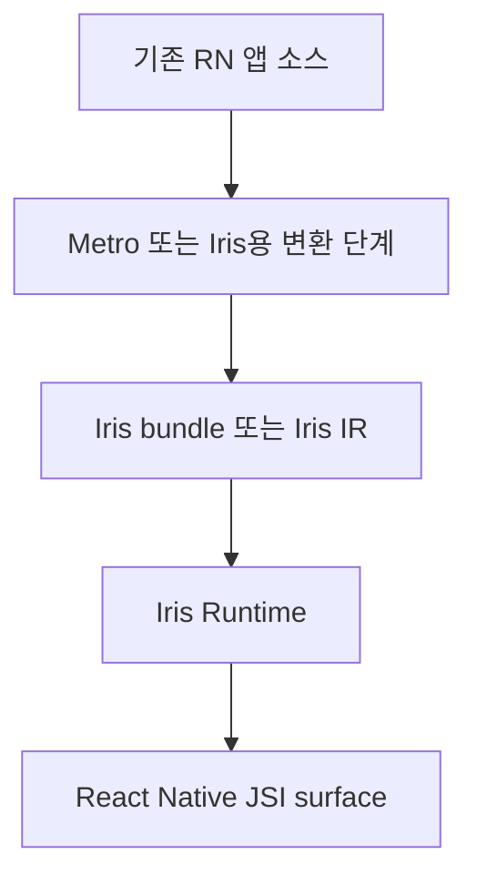
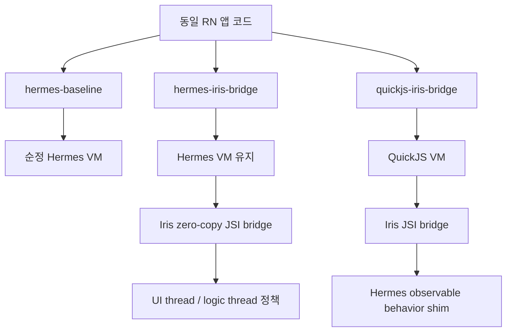

# Iris 엔진 전략

Iris의 제품 목표는 Hermes bytecode 호환 엔진이 아니라 React Native Hermes 관측 가능 동작 호환 엔진이다.

## 최우선 호환성 정의

Iris v1은 사용자가 기존 React Native 앱 코드를 수정하지 않고 엔진만 Iris로 바꿨다고 느끼는 것을 목표로 한다. 호환성 기준은 내부 bytecode 형식이 아니라 앱과 React Native가 관측하는 동작이다.

필수 기준은 다음이다.

- 같은 React Native 앱 코드가 Hermes와 Iris에서 수정 없이 실행된다.
- JavaScript 실행 결과가 Hermes와 같다.
- JSI `Runtime`, `Value`, `Object`, `Function`, `HostObject`, `HostFunction`, `ArrayBuffer` 경계가 Hermes와 같은 방식으로 보인다.
- Promise, microtask, timer, unhandled rejection, exception propagation 순서가 Hermes와 호환된다.
- `Error` 객체, stack trace, source map, symbolication, crash diagnostic이 Hermes 기준선과 호환된다.
- React Native core가 참조하는 `HermesInternal` surface를 제공한다.
- Fabric, TurboModule, Codegen, Metro, debugger, profiler 경계가 기존 앱 코드 수정을 요구하지 않는다.
- Android와 iOS에서 사용자가 선택하는 엔진 경험이 동일해야 한다.

## 필수가 아닌 것

다음은 호환성 목표가 아니다.

- Hermes HBC 파일을 그대로 실행하는 것
- Hermes bytecode format을 Iris의 내부 IR로 고정하는 것
- `hermesc` 산출물을 Iris release의 유일한 입력으로 유지하는 것
- QuickJS, JavaScriptCore, 자체 IR 같은 backend 실험을 금지하는 것

Hermes HBC는 strict 비교와 분석용 baseline으로 사용할 수 있다. 하지만 HBC 실행 성공이 RN/Hermes 관측 가능 동작 호환을 증명하지는 않는다.

## Bundle Pipeline 원칙

Iris는 자체 bundle pipeline을 가질 수 있다.

허용되는 변경은 다음 조건을 만족해야 한다.

- 앱 소스 코드는 Hermes 기준선과 동일해야 한다.
- 사용자는 Babel plugin, JS shim, import path 변경 같은 앱 코드 마이그레이션을 요구받지 않아야 한다.
- bundle artifact가 Hermes HBC가 아니라면 PR과 benchmark artifact에 compiler, input source hash, transform 옵션, runtime backend를 기록한다.
- Iris 전용 transform이 observable behavior를 바꾼다면 기본 경로가 아니라 opt-in 실험으로 격리한다.
- Hermes/JSC fallback을 Iris 성능값으로 측정하지 않는다.

## Backend 후보 정책

Backend는 구현 세부사항이다. 후보 선택은 React Native/Hermes 관측 가능 동작 호환과 성능 측정으로 판단한다.

- `iris-hbc`: Hermes HBC 분석, strict 동일 입력 비교, scalar executor 기준선에 사용한다. 최종 제품 경로로 고정하지 않는다.
- `iris-qjs`: QuickJS 기반 RN bootstrap/JSI 호환성 실험 backend로 사용할 수 있다. Hermes 관측 가능 동작 shim과 RN 경계 검증이 동반되어야 한다.
- `iris-ir`: 장기적으로 Iris 자체 IR/compiler를 둘 수 있다. 이 경우 Metro/RN bundle pipeline 계약과 source map/debugger 전략을 먼저 문서화한다.
- JavaScriptCore는 플랫폼 참고 또는 opt-in 실험으로 다룬다.
- V8은 iOS 동일 비교축이 없으므로 기본 Hermes 대체 엔진 후보가 아니라 사례 참고 대상으로만 다룬다.

## Benchmark 분류

성능 주장은 다음 분류를 명시해야 한다.

| 분류                           | 의미                                                                                                                        | ratio 허용                                                |
| ------------------------------ | --------------------------------------------------------------------------------------------------------------------------- | --------------------------------------------------------- |
| RN strict engine comparison    | 같은 RN 앱 코드, 같은 benchmark case 계약, 같은 checksum, release build, Hermes/Iris runtime이 모두 실제 JS workload를 완료 | 허용                                                      |
| HBC strict microbenchmark      | 같은 JS 소스와 같은 HBC 파일을 Hermes와 Iris HBC executor가 실행                                                            | 허용하되 RN 체감 성능으로 주장 금지                       |
| QuickJS backend microbenchmark | 같은 JS benchmark case를 host-side `iris-qjs` backend가 실행하고 checksum을 검증                                            | 허용하되 RN 체감 성능으로 주장 금지                       |
| Iris bootstrap/frontier        | Iris runtime이 metadata parse, coverage scan, execution frontier를 측정                                                     | Hermes JS workload ratio 금지                             |
| Hermes JSI bridge fast path    | 같은 Hermes 앱 안에서 TurboModule/JS copy 경계와 Iris-owned JSI HostFunction/native buffer 경계를 비교                      | bridge boundary 주장에만 허용. 포맷 변경 case는 별도 표시 |
| Native mirror                  | JS workload와 비슷한 native 계산 probe                                                                                      | strict engine ratio 금지                                  |

HBC strict microbenchmark는 좋은 회귀 기준선이지만, 사용자가 체감하는 "엔진만 바꿨더니 빨라짐"을 증명하려면 RN strict engine comparison이 필요하다.
RN strict engine comparison은 `tools/bench/strict-rn-benchmark-contract.ts`의 suite/case 계약과 case별 checksum equality가 맞을 때만 ratio를 만든다.

## JS 실행 최적화 우선순위

Iris가 기존 RN 앱 소스 수정을 요구하지 않고 Hermes보다 빨라지려면, zero-copy bridge 이전에 일반 JS property access 비용을 줄여야 한다. 최적화 후보는 `bench-strict-hbc-timing-profile`의 `topPropertyTimings`, `topIndexedTimings`, `topCallTargetTimings`로 먼저 확인하고, strict HBC repeat artifact와 gate 비교로만 채택한다.

현재 우선순위는 다음이다.

- `GetByIdShort`/`TryGetById`/`PutByIdLoose`의 hot property shape를 property 이름, base kind, opcode offset별로 분리한다.
- broad global cache나 broad named get/put expansion은 과거 A/B에서 여러 번 회귀했으므로 기본 후보로 두지 않는다.
- hot path 상태를 새로 늘리는 보조 캐시는 단발 timing이 아니라 repeat/gate로 이득이 확인될 때만 채택한다.
- getter/prototype/own-property shadowing을 보존할 수 있는 좁은 guard를 먼저 둔다.
- fast path가 실패하면 기존 generic semantic path로 내려가야 한다.
- host-side HBC microbenchmark에서 Hermes보다 빠른 case가 생겨도 RN strict engine comparison이 아니면 엔진 교체 성능 주장으로 쓰지 않는다.

## 비교 lane

최종 비교 목표는 단순히 "Hermes 대 QuickJS"가 아니라 같은 RN 앱을 세 실행 구조로 나누어 보는 것이다.

- `hermes-baseline`: 순정 RN/Hermes release 기준선이다.
- `hermes-iris-bridge`: Hermes VM은 그대로 쓰되 Iris가 JSI transfer, native-owned buffer, object lifetime, logic-thread scheduling을 맡는 목표 lane이다. 현재 첫 구현은 `IrisBridgeTurboModule`이 설치하는 JSI HostFunction fast path, same-method JS facade, native-owned `ArrayBuffer` handoff, columnar object payload다. number/string case는 통신 payload 포맷이 같고, facade case는 method/payload surface도 TurboModule과 맞춘다. buffer/object case는 zero-copy 친화 포맷으로 바뀐 diagnostic case다. 이 lane은 QuickJS가 느린지와 별개로 "엔진을 바꾸지 않고도 bridge 구조만으로 빨라질 수 있는가"를 검증한다.
- `quickjs-iris-bridge`: QuickJS backend를 쓰되 같은 Iris bridge 정책을 적용하는 목표 lane이다. 현재 QuickJS backend microbenchmark는 이 lane의 일부 근거일 뿐 RN strict engine comparison이 아니다.

세 lane은 `tools/bench/runtime-lanes.ts`에 코드로 고정한다. 성능 주장은 해당 lane id와 artifact path를 함께 적어야 한다.
